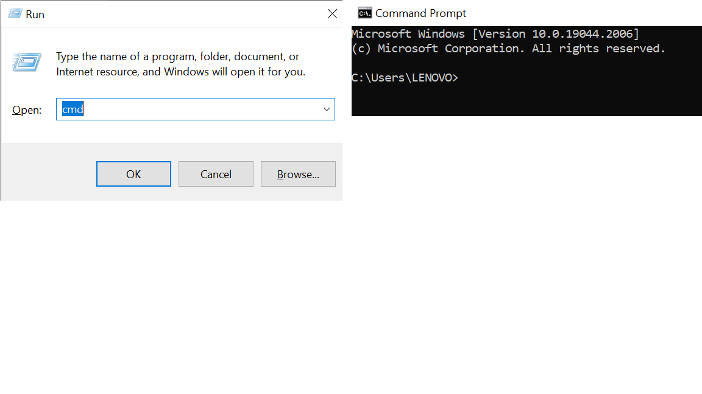

# Summary
```
Minggu 1 Coding Bootcamp
Nama  : Salsabilla Pramudita
Track : FrontEnd Web Development
```
Materi :

- Unix Command Line
- Git & GitHub dasar
- HTML
- CSS
- Algoritma
- JavaScript (JS dasar & Js Conditional)


## Unix Command Line
"command line" atau "command line interface", sebenarnya yang dimaksud adalah shell yang berbasis teks
##### Shell
**Shell** merupakan user interface yang mengelola CLI dan berperan sebagai perantara yang menghubungkan user dan sistem operasi
##### Command Line Interface(CLI)
**CLI** adalah mekanisme interaksi dengan sistem operasi atau perangkat lunak komputer dengan mengetikkan perintah untuk menjalankan tugas tertentu
Cara mengakases CLI di laptop atau PC dengan sistem operasi windows dapat menekan win+R, lalu mengetikkan "cmd"



**File System Structure**
FIle System adalah struktur logika yang digunakan untuk mengendalikan akses terhadap data yang ada pada harddisk
- Sebuah filesystem mengatur bagaimana data disimpan di dalam sebuah system
- Sistem operasi Windows & Unix-like menyusun file dan direktori menggunakan struktur yang bentuknya mirip tree

**Command untuk Navigasi**

| Command | fungsinya |
| ------ | ------ |
| pwd | melihat current working directory |
| ls | melihat isi sebuah directory  |
| cd | berpindah directory  |
| type/cat | melihat isi files |
| mkdir | membuat direktori |
| touch | membuat file |
| cp |menyalin file & direktori  |
| mv |untuk memindahkan atau me-rename file dan direktori   |
| rm|untuk menghapus file & direktori  |
## Git & GitHub

##### Kenapa Git dan Github tools yang wajib digunakan?
Karena kedua platform ini sangat membantu pekerjaan programmer dalam menyusun kode script secara grup/tim. Seluruh pekerjaan juga dapat dipantau dan dievaluasi dengan mudah karena penggunaan kontrol sistem.

**GIT**
Git adalah aplikasi yang dapat melacak setiap perubahan yang terjadi pada suatu folder atau file.

**GitHub**
GitHub adalah layanan cloud yang berguna untuk menyimpan dan mengelola sebuah project yang dinamakan repository.

**Perbedaan Git & GitHub**
| Git | GitHub |
| ------ | ------ |
| diakses secara offline | diakses secara online |
| di-install pada penyimpananan lokal | melalui layanan cloud |
| sebagai control version system | sebagai source code hosting |
| open source | pilihan bagi pengguna gratis dan berbayar |

**Instalasi Git**
sebelumnya download aplikasi git seperti aplikasi biasa. dilanjutkan membuat akun github.
###### Setup Awal
- **git config --global user.nama "nama"**. setelah proses instalasi git lalu ditampilkan sebuah layar terminal git bash, nah disana kita ketikkan syntax ini untuk memasukkan nama
- **git config --global user.email "nama"**. fungsi syntax ini untuk mengisikan email, perlu diingat email yang dimasukkan harus sama dengan email yang kita daftarkan pada akun github
- **git --version**, syntax ini bisa kita gunakan untuk mengecek instalasi git pada pc/laptopp kita sudah berhasil atau belum.
- **git config --list**, syntax ini berfungsi untuk mengecek apakah setup yang kita atur diawal(mengisi nama dan email) sudah berhasil atau belum.

###### Repository
- **git init namaproyek**, syntak disamping berfungsi untuk membuat repository baru.
- **git init.**, gunakan syntax ini jikalau nama folder sudah ada sebelumnya

