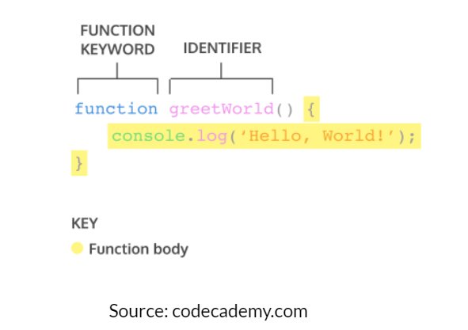

# Summary
```
Minggu 2 Web Development
Nama  : Salsabilla Pramudita
Track : FrontEnd Web Development
```
Materi :
- Javascript Function dan Scope
- Type data dan Properties Method
- DOM

### Day 1 Javascript Function
Function adalah sebuah blok kode dalam sebuah grup untuk menyelesaikan 1 task/1 fitur. Saat kita membutuhkan fitur tersebut nantinya, kita bisa kembali menggunakannya.

- **Struktur Fungsi**


```
\\contoh kodingan
function gretting(){
    return 'hello salsa'
}
```
- **Memanggil Function**
```
gretting()
console.log(gretting()); //output : "hello salsa"
```

- **Paramater**\
Dengan parameter, function dapat menerima sebuah inputan data dan menggunakannya untuk melakukan task/tugas.
Saat membuat function/fitur, kita harus tahu data-data yang dibutuhkan. Misalnya saat membuat function penambahan 2 buah nilai. Data yang dibutuhkan adalah 2 buah nilai tersebut.
```
function penambahan(a, b){
    return a + b;
}
```

- **Argumen**\
Argumen adalah nilai yang digunakan saat memanggil function.
Jumlah argumen harus sama dengan jumlah parameternya
Jadi jika di function penambahan ada 2 parameter nilai saat membuat function. Saat memanggil function kita gunakan 2 buah nilai argumen.  saat kita mengembangkan aplikasi dengan skala besar, function sangat sangat dibutuhkan agar kita dapat dengan mudah memanage code dan tracing code jika ada error.
```
function penambahan(a, b){
    return a + b;
}
console.log(penambahan(2,5));//output: 7
```
-	**Default Parameters**\
Default paramaters digunakan untuk memberikan nilai awal/default pada parameter function. Default parameters bisa digunakan jika kita ingin menjaga function agar tidak error saat dipanggil tanpa argumen
-	**Function Helper**\
Kita bisa menggunakan function yang sudah dibuat pada function lain.
-	**Arrow Function**\
Arrow function adalah cara lain menuliskan function. Ini adalah fitur terbaru yang ada pada ES6 (Javascript Version)

- **Contoh Kasus**\
"Mencari Angka"
```
function cariAngka(x){
    let isKetemu= false
    let i = 1
    for(i; i<=20; i++){
        if(i == x){
            console.log(i, 'yes ketemu');
            isKetemu = true
        }
    }
        if(!isKetemu){
            console.log('data tidak ditemukan')
        
    }
}
cariAngka(14)
cariAngka(3)
cariAngka(23)
```
**output**

