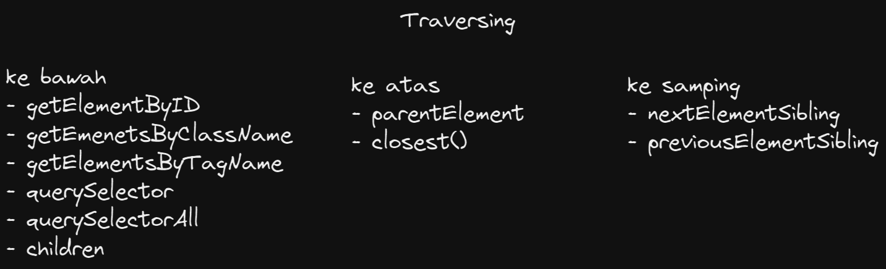

# Summary
```
Minggu 2 Web Development
Nama  : Salsabilla Pramudita
Track : FrontEnd Web Development
```
Materi :
- Javascript Scope dan Function
- Type data dan Properties Method
- DOM

### Day 1 Javascript Scope dan Function
#### Scope
Scope adalah konsep dalam flow data variabel. Menentukan suatu variabel bisa diakses pada scope tertentu atau tidak.
-	**Blocks**\
Blocks adalah code yang berada didalam curly braces {}. Conditional, function, dan  looping menggunakan blocks.
-	**Global Scope**\
Global scope berarti variabel yang kita buat dapat diakses dimanapun dalam suatu file. Agar menjadi Global Scope, suatu variabel harus dideklarasikan diluar Blocks.
-	**Local Scope**\
Local scope berarti kita mendeklarasikan variabel didalam blocks seperti function, conditFunction adalah sebuah blok kode dalam sebuah grup untuk menyelesaikan 1 task/1 fitur. Saat kita membutuhkan fitur tersebut nantinya, kita bisa kembali menggunakannya.
ional, dan looping. Maka variabel hanya bisa diakses didalam blocks saja. Tidak bisa diakses diluar blocks.

#### Function
Function adalah sebuah blok kode dalam sebuah grup untuk menyelesaikan 1 task/1 fitur. Saat kita membutuhkan fitur tersebut nantinya, kita bisa kembali menggunakannya.

- **Struktur Fungsi**


```
\\contoh kodingan
function gretting(){
    return 'hello salsa'
}
```
- **Memanggil Function**
```
gretting()
console.log(gretting()); //output : "hello salsa"
```

- **Paramater**\
Dengan parameter, function dapat menerima sebuah inputan data dan menggunakannya untuk melakukan task/tugas.
Saat membuat function/fitur, kita harus tahu data-data yang dibutuhkan. Misalnya saat membuat function penambahan 2 buah nilai. Data yang dibutuhkan adalah 2 buah nilai tersebut.
```
function penambahan(a, b){
    return a + b;
}
```

- **Argumen**\
Argumen adalah nilai yang digunakan saat memanggil function.
Jumlah argumen harus sama dengan jumlah parameternya
Jadi jika di function penambahan ada 2 parameter nilai saat membuat function. Saat memanggil function kita gunakan 2 buah nilai argumen.  saat kita mengembangkan aplikasi dengan skala besar, function sangat sangat dibutuhkan agar kita dapat dengan mudah memanage code dan tracing code jika ada error.
```
function penambahan(a, b){
    return a + b;
}
console.log(penambahan(2,5));//output: 7
```
-	**Default Parameters**\
Default paramaters digunakan untuk memberikan nilai awal/default pada parameter function. Default parameters bisa digunakan jika kita ingin menjaga function agar tidak error saat dipanggil tanpa argumen
-	**Function Helper**\
Kita bisa menggunakan function yang sudah dibuat pada function lain.
-	**Arrow Function**\
Arrow function adalah cara lain menuliskan function. Ini adalah fitur terbaru yang ada pada ES6 (Javascript Version)

- **Contoh Kasus**\
"Mencari Angka"
```
function cariAngka(x){
    let isKetemu= false
    let i = 1
    for(i; i<=20; i++){
        if(i == x){
            console.log(i, 'yes ketemu');
            isKetemu = true
        }
    }
        if(!isKetemu){
            console.log('data tidak ditemukan')
        
    }
}
cariAngka(14)
cariAngka(3)
cariAngka(23)
```
**output**


dari output yang dikeluuarkan dari codingan kasus yang kita buat dapat dilihat bahwa angka 14 dan 3 output nya "yes ketemu", sementara angka 23 outputnya "data tidak ditemukan". Mengapa demikian?, Karena di codingan kita membuat batas loopingnya(isKetemu)adalah 20, yang artinya perulangan akan berhenti diangka 20, dan maka dari itu angka 23 tidak dapat ditemukan ini diperoleh karna kita memberikan else pada kodingan.\
**Contoh Kasus**
```
function nama(a){
    console.log(`halo apa kabar ${a}?`);   

}
nama("Salsa")
```
**output**


### Day 2 Data Type Built in Prototype & Method
**Method**
Method dapat menerima argumen sebagai nilai masukan yang akan diproses di dalam method bersangkutan. Method dapat kita gunakan (panggil) berulang-ulang dari mana saja dalam program kita.

Tipe data Primitiv
- String
- Number
- Boolean

Tipe data Non Primitiv
- Array
- Object
- 
#### **Method String**
- typeOf()
fungsinya untuk  menunjukkan tipe data dari syntax yang kita buat
```
let hewan = "sApI"

console.log(typeof hewan))// output : string
```
dari codingan diatas dapat dilihat outputnya adalah string,yang mana variabel hewan tipe datanya adalah string
- toUpperCase()
fungsinya untuk menjadikan isi variabel menjadi huruf kapital.

```
let hewan = "sApI"
console.log(hewan.toUpperCase()); output: SAPI
```
- toLowerCase()
fungsinya untuk menjadikan isi variabel menjadi huruf kecil.
```
let hewan = "sApI"
console.log(hewan.toLowerCase());
```
- charAt()
fungsinya mirip seperti array.
```
let hewan = "sApI"
console.log(hewan.charAt(1))//output: A
```
bisa dilihat pada codingan diatas, ouputnya adalah A, karena charArt akan mengambil nilai dari huruf tersebut berdasarkan inputan yanga da di dalam kurungnya si charArt, sama seperti array, dihiung dari 0.
- split()\
Split digunakan untuk membagi string menjadi array substring dan mengembalikan array baru tanpa mengubah string asli
```
let kalimat="dengan split kita dapat memngubah kalimat ke dalam bentuk array"
console.log("before ", kalimat);
console.log("after",kalimat.split(" "))
```

**output**


#### **Method Number**
- Number()
```
console.log(Number("123")); //output : 123
```
- isNaN()

isNan() merupakan sebuah function yang menguji apakah nilai dari parameter expression itu adalah bukan angka
```
console.log(isNaN(2131)) // false
console.log(isNaN("dawdf")) // true
```
dari output kita dapat melihat bahwa 2131 hasilnya false, dikarenakan method isNaN ini mengecek apakah expression itu adalah angka, nah disini expression tersebut adalah angka maka hasilnya false.\
- toFixed()

Method toFixed digunakan untuk membuat tampilan angka dengan jumlah desimal yang tetap
```
let angka = 3.12345
console.log(angka.toFixed(1)) // 3.1
console.log(angka.toFixed(2)) // 3.12
```

#### **Method Math**
- abs()

berfungsi untuk menghasilkan nilai absolut atau nilai positif dari nilai negatif yang di tentukan didalam argumen angka didalam fungsi tersebut
```
console.log(Math.abs(-5)) // 5
```
- ceil()

digunakan untuk membulatkan bilangan desimal keatas
```
console.log(Math.ceil(5.2)) // 6
```
- floor()

untuk mengembalikan nilai menjadi bilangan bulat dari yang terbesar kurang dari atau sama dengan
```
console.log(Math.floor(5.6)) // 5
```
- round()

digunakan untuk membulatkan bilangan desimal ke bilangan terdekat, fungsi tersebut membutuhkan 1 argumen yang ingin dibulatkan
```
console.log(Math.round(5.6)) // 6
console.log(Math.round(5.2)) // 5
```
- random()

memberikan nilai acak
```
console.log(Math.random()) // 0.123342
```
#### Method Date
```
console.log(Date()) // 'Tue Sep 27 2022 20:31:20 GMT+0700 (Indochina Time)'
console.log(Date.now()) // 1664285495449
```

#### Prototype
- reverse()\
reverse() merupakan method array di JavaScript yang berfungsi untuk membalikkan urutan array, elemen pertama jadi terakhir dan elemen terakhir jadi yang pertama.

**contoh kasus**

```
// hallo -> ollah

// membuat method baru utk tipe data string
String.prototype.reverse = function(){
  let s = ""
  for (let i = String(this).length-1; i >= 0 ; i--) {
    s = s + String(this)[i]
  }

  return s
}

// method yg dimiliki oleh string
console.log("hallo".reverse())
console.log("selamat datang".reverse())

// function dgn argumen string
// console.log(reverse("hallo"));
```

### Day 3 DOM Introduction dan Traversing Element
Apa itu DOM?


Document Object Model atau DOM BUKAN bagian dari javascript, melainkan DOM adalah sebuah API untuk membangun website yang bisa dipakai oleh semua bahasa pemograman

**DOM dalam bentuk tree struktur**


disaat kita akses dom, kita dapat 4 hasil


**Traversing**

Apa itu Traversing?

Traversing adalah mencari suatu elemen HTML berdasarkan hubungan (relation) dengan elemen HTML lainnya

Jenis Traversing


**Traversing Kebawah**/
file index.html
```
<!DOCTYPE html>
<html lang="en">
<head>
    <meta charset="UTF-8">
    <meta http-equiv="X-UA-Compatible" content="IE=edge">
    <meta name="viewport" content="width=device-width, initial-scale=1.0">
    <title>Document</title>
    <script src="script.js" defer></script>
</head>
<body>
    <h1 onclick="alert('selamat datang')">halo</h1>

    <h1 id="title">Hallo</h1>

    <ul class="list">
      <li class="item">satu</li>
      <li class="item">dua</li>
      <li class="item">tiga</li>
    </ul>

    <p id="paragraf">Click</p>
    <button id="btn">submit</button>
</body>
</html>
```
**get-family**
```
let title = document.getElementById("title")//Memanggil tag HTML berdasarkan ID
console.log(title)

let items = document.getElementsByClassName("item")//Memanggil tag HTML berdasarkan class
console.log(items[2]);

let list = document.getElementsByClassName("list")//Memanggil tag HTML berdasarkan class
console.log(list[0])
console.log(list[0].children)

let itemByTag = document.getElementsByTagName("li")//Memanggil tag HTML berdasarkan nama tag
console.log(itemByTag[1])
console.log(itemByTag.item(1))
console.log(itemByTag.length)
```

**Query Selector**
```
let listQuery = document.querySelector(".list")
console.log(listQuery);

let itemQueryAll = document.querySelectorAll(".item")
console.log(itemQueryAll)
```

**Traversing KeAtas**
```
console.log(itemQuery.parentElement);
console.log(itemQuery.closest(".list"));
```

**Traversing Ke Samping**
```
console.log(itemQuery.previousElementSiblingc);
console.log(itemQuery.nextElementSibling);
```

### Day 4 DOM Manipulating Elements dan Manipulating Styles
file html
```
<!DOCTYPE html>
<html lang="en">
  <head>
    <meta charset="UTF-8" />
    <meta http-equiv="X-UA-Compatible" content="IE=edge" />
    <meta name="viewport" content="width=device-width, initial-scale=1.0" />
       
    <title>Document salsa</title>

    <style>
      #tess {
        width: 100px;
        height: 20px;
        background-color: brown;
      }

      p {
        background-color: antiquewhite;
      }
    </style>
  </head>
  <body>
    <div id="tess"></div>

    <div id="app"></div>

    <div id="end">
    </div>
    
    <div class="container">
      <a href="google.com" class="link">Google</a>
    </div>

    <script src="./script.js"></script>
  </body>
</html>
```
- memberikan konten
```
app.innerHTML = "<h1>Hallo</h1>"
```
- membuat element
```
let p = document.createElement("p")
p.innerText = "ini adalah paragraf"
```
    -  menambahkan child kedalam parent
    ```
    app.append(p)
    ```
    - append vs appendChild
    ```
    app.append("menggunakan append")
    ```
    appenchild tidak bisa input data string
- remove element
 ```
 let end = document.getElementById("end")
end.remove()

let link = document.getElementsByClassName("link")[0]
 ```
- attribute
```
console.log(link.attributes) // [] list attribute
console.log(link.getAttribute("href")); // ambil isi attribute
link.setAttribute("id", "google") // add attribute
```
- memberikan style
```
link.style.color = "black"
link.style.border = "1px solid black"
link.style.padding = "5px 20px"
link.style.backgroundColor = "aqua"
link.style.removeProperty("border") // menghapus style property
```
- mendapatkan style dari element
```
let tess = document.getElementById("tess")
let tessStyle = getComputedStyle(tess)
console.log(tessStyle.height)
```
- class
```
let container = document.getElementsByClassName("container")[0]
console.log(container.classList); // [] list of class
container.classList.add("home") // menambahnkan class
container.classList.remove("container") // menghapus class
```

### Day 5 DOM Events dan DOM Forms
**Events**
Events adalah kejadian/kegiatan/interaksi yang user berikan kepada website/
events terdiri dari : 
- click
- submit
- focus
- blur
- hover
- change
- scroll

**3 Cara menampilkan Events**
- HTML Atribut
    ```
    <h1 onclick="alert('selamat datang')"> hallo</h1>
    ```
   html atribut maksudnya adalah kita memberikan events pada file html nya langsung
   
- Event Property
    - codingan html
      ```
      <p id="paragraf">click me</p>
      ```
    - codingan js
      ```
      let paragraf = document.getElementById("paragraf")

       paragraf.onclick = function () {
       alert("ini pragraf")
       }
      ```
      Event Property ini maksdnya kita menambahkan event di file js kita, yang mana di file html nya harus ada element yang akan kita panggil. disini saya menggunakan id untuk memanggil elemnt tersebut
- addEventListener
  - codingan html
      ```
        <button id="btn">submit</button>
      ```   
     
   - codingan js
      ```
        let button = document.getElementById("btn")
        button.addEventListener("click",function ()  {
            alert("ini button")
        })
      ```
      sama halnya dengan event property, addEventListener juga memanggil element yang ada di file html nya. tetapi beda addEventListener dengan event property adalah di addEventListener kita dapat menjalankan multiple event.

#### Contoh project sederhana events

Membuat Tampilan Login sederhana
- codingan html
    ```
    <!DOCTYPE html>
    <html lang="en">
    <head>
        <meta charset="UTF-8">
        <meta http-equiv="X-UA-Compatible" content="IE=edge">
        <meta name="viewport" content="width=device-width, initial-scale=1.0">
        <title>Document salsa</title>
        <script src="login.js" defer></script>
    </head>
    <body>
        <div class="container">
            <form id="sign-in">
                <h1>Sign In</h1>


                <div class="field">
                    <label for="username">Username</label>
                    <input type="text" id="username" name="username" />
                </div>

                <div class="field">
                    <label for="password">Password</label>
                    <input type="password" id="password" name="password" />
                </div>
                <button type="submit"> Log In</button>

            </form>  


        </div>

    </body>
    </html>
    ```
- codingan js
    ```
    let loginForm = document.querySelector("#sign-in")
    let inputUsername = document.querySelector('#username')
    let inputPassword = document.querySelector('#password')

    let user = {
      username: "salsabilla",
      password: "12345"
    }

    loginForm.addEventListener("submit", (event) => {
      event.preventDefault()

      let userLogin = {
        username: inputUsername.value,
        password: inputPassword.value
      }

      console.log(userLogin);

      let login = userLogin.username == user.username && 
                  userLogin.password == user.password;

      if (login) {
        console.log("selamat anda berhasil login")
      } else {
        console.log("username dan password anda salah");
      }

      // Membersihkan form
      // cara 1
      loginForm.reset()

      // cara 2
      // inputUsername.value = ""
      // inputPassword.value = ""

      // console.log("ini dari form yg di submit");
    })

    ```    


