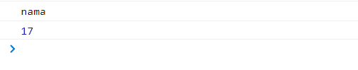
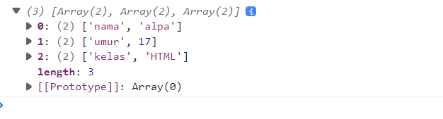
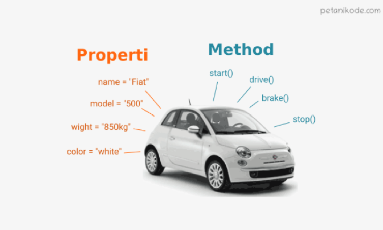
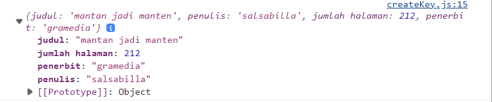
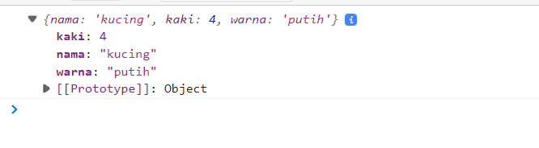
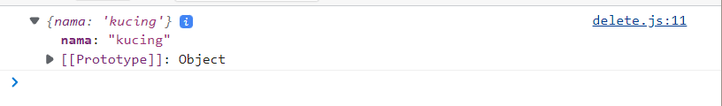
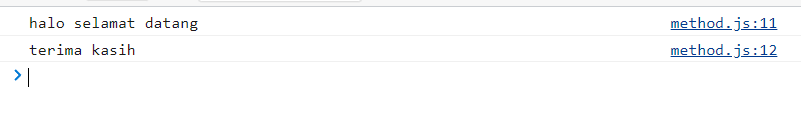
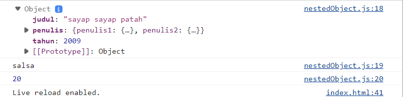
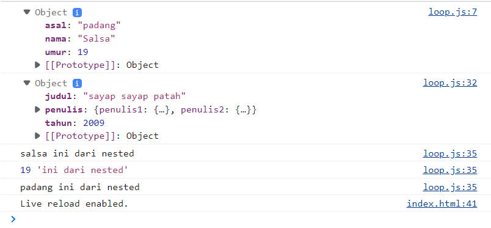
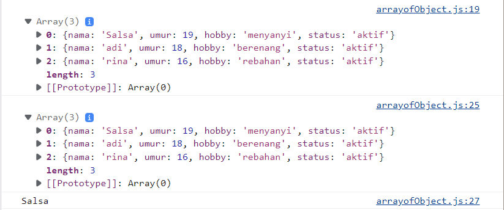

# Summary
```
Minggu 3 Web Development
Nama  : Salsabilla Pramudita
Track : FrontEnd Web Development
```
Materi :
- JavaScript intermediate - Array & Multidimensional Array
- JavaScript Intermediate - Object & Array of Object
- JavaScript Intermediate - Rekursif dan JavaScript Intermediate - Modules
- JavaScript Intermediate - Web Storage
- JavaScript Intermediate - Asynchronous - Introduction dan JavaScript Intermediate - Asynchronous - Promise


### Day 1 JavaScript intermediate - Array & Multidimensional Array

#### Array
Array di dalam Javascript mampu menyimpan banyak data dengan tipe data yang berbagai macam
- **Cara Membuat Array**
    ```
    let arr = ["hallo", 1, "true"]
    ```
- **Cara akses Array** 
    ```
    console.log(arr)
    ```
    berdasarkan index
    ```
    console.log(arr[1]) //output 1
    ```
- **Array Properties**
   - length\
        length berfungsi untuk menjumlahkan banyak array
    ```
    console.log(arr.length)
    ```
   - push()\
        Menambahkan elemen baru ke akhir array, dan mengembalikan panjang baru
      ```
      let arrBuah = ["jeruk","semangka", "pepaya", "rambutan"]

       arrBuah.push("durian")//
      ```
      output
      
      \
      bisa dilihat dari codingan dan hasilnya, di array arrBuah kita tidak menambahkan "durian", dengan push() kita bisa menambahkan data "durian", perlu diperhatikan push() hanya bisa menambahkan data diposisi akhir. 
      
   - pop()\
        Menghapus elemen terakhir dari array, dan mengembalikan elemen itu\
        ```
        arrBuah.pop()
        console.log(arrBuah)
        ```
        output
      
      \
      output yang dihasilkan adalah seperti gambar diatas, yang mana data "durian" yang kita push sebelumnya sudah terhapus, beginilah cara kerja pop()
        
   - unshift()        
        Menambahkan elemen baru ke awal array, dan mengembalikan panjang baru\
        ```
        arrBuah.unshift("apel")
        console.log(arrBuah)
        ```
       output
      
      \
      pada gambar diatas terdapat "apel", yang mana itu kita dapatkan dari properti unshift
      
   - shift()        
        Menghapus elemen pertama dari array, dan mengembalikan elemen itu
        ```
         arrBuah.shift()
         console.log(arrBuah)
        ```
      output
      
      \
      dari gambar diatas, element pertama sudah hilang, itu karna properti shift looh
   - splice()\
      Menambahkan/Menghapus elemen dari array
      ```
      arrBuah.splice(2, 0, "buah pisang")
      ```
      splice, merubah data arraynya dan dapat mereturn nilai
   - slice()\
        Memilih bagian dari array, dan mengembalikan array baru
      ```
      let slice = arrBuah.slice(2, 4)
      console.log(arrBuah)
      console.log(slice)      
      ```
      mengambil data dengan cara men-copy
  
 **Looping pada Array**
 
- For Of\
    JavaScript untuk pernyataan loop melalui nilai-nilai objek yang dapat diubah. Ini memungkinkan Anda mengulang struktur data yang dapat diubah seperti Array, Strings, Maps, NodeLists, dan banyak lagi
    ```
        for (variable of iterable) {
      // code block to be executed
    }    
    ```
    
    contoh 
    ```
    let arrBuah = ["jeruk","semangka", "pepaya", "rambutan"]
    
    for(let buah of arrBuah){
    console.log(buah)
    }
    ```
    
    output
    
    
    
  
- For Each
    
    Metode forEach() memanggil fungsi untuk setiap elemen dalam array.

    Metode forEach() tidak dijalankan untuk elemen kosong
    
    ```
    array.forEach(function(currentValue, index, arr), thisValue)    
    ```
    contoh
    ```
     let arrBuah = ["jeruk","semangka", "pepaya", "rambutan"]
      arrBuah.forEach((item) => {
      console.log(item)
    })
    ```
    output
    
    
    
- Map
    map() membuat array baru dari memanggil fungsi untuk setiap elemen array.

    map() memanggil fungsi sekali untuk setiap elemen dalam array.

    map() tidak menjalankan fungsi untuk elemen kosong.

    map() tidak mengubah array asli
    
    ```
    array.map(function(currentValue, index, arr), thisValue)
    ```
    contoh 
    ```
        let Buah = arrBuah.map((item, index) => {
        if(index % 2 === 0){
        return item + " "+ "segar"
        }
    })

     console.log(Buah)

    ```
    output
    
    \
    
    bisa dilihat dari gambar diatas map bisa mereturn array
  
**Perbedaan Looping pada array**


\


**Contoh Kasus**
Merubah angka desimal menjadi persen

- menggunakan map
    ```
    let angkaDes = [
        0.45,
        0.23,
        0.54,
        0.65,
    ]

    let angkaPersen = angkaDes.map((item) => {
        return item * 100 + "%"

    })   
     console.log(angkaPersen)
    ```
    
- menggunakan for each
    ```
    let angkaPersenforEach= []
    angkaDes.forEach((item) => {
        angkaPersenforEach.push(item * 100 + "%")

    })
    console.log(angkaPersenforEach)

    ```
    
    Kasus seperti ini lebih baik menggunakan map
    
    output
    
    
    
 #### Multidimensional Array
 Multidimensional Array bisa dianalogikan dengan array of array. Ada array didalam array
 
 
 - Akses index multidimensional array
 
 
 
- contoh
  ```
      let arrMulti = [
      ["nama", "alpha"],
      ["umur", 17],
      ["kelas", "JS"],
    ]

    console.log(arrMulti[0][1]);
    console.log(arrMulti[2][1])
  ```
  output
  
  
  
  mengganti data array
  ```
      arrMulti[2][1] = "HTML"
    console.log(arrMulti)
  ```
  output
  
    
  
  
  
 ### Day 2 JavaScript Intermediate - Object & Array of Object\
 object adalah sebuah tipe data pada variabel yang menyimpan properti dan fungsi (method)
- Properti adalah data lengkap dari sebuah object.

- Method adalah action dari sebuah object. Apa saja yang dapat dilakukan dari suatu object.
-  contoh objek mobil dengan properti nilai dan method
    
    
 - membuat sebuah object
    syntax dasar
    ```
     let nama_obj = {
        key1: "value",
        key2: "value1",
     };
    ```
    contoh
     ```
       let siswa = {
        nama : "Salsa",
        umur : 19,
        hobby : "menyanyi",
        'nomor handphone' : 08987654,
     };
     console.log(siswa)
     ```
     Sama seperti tipe data sebelumnya. Object dapat diassign kedalam sebuah variabel\
     Sama seperti array, didalam object kita dapat menyimpan properti dengan tipe data apapun.\
     note :key pada object disebut juga dengan properti
     
 - Mengakses Object dan Property Object
     - membuat object nya dahulu
     ```
     let siswa = {
        nama : "Salsa",
        umur : 19,
        hobby : "menyanyi",
        'nomor handphone' : 08987654,
     };
     ```
     
     - ada 2 cara mengakses object
     **dot notation**
     ```
      console.log(siswa.nama)
     ```
     **bracket**
     ```
      console.log(siswa["hobby"])
      console.log(siswa["nomor handphone"])
     ```
- Membuat Key/Update Object
        ```
        let buku = {
            judul : "mantan jadi manten",
            penulis : "salsabilla",
            "jumlah halaman" : 212,


        }
        console.log(buku);
        
        //ada 2 cara
        //cara 1
        buku.tahun = 2022;
        buku.terjual = 1000;
        console.log(buku);   
        ```
        Output
        
         
        
        
        ```
             //cara 2
        buku["penerbit"] = "gramedia";
        console.log(buku)
        ```
        Output
        
         
         
 - Menghapus Object
    Kita dapat menghapus properti dari object menggunakan delete operator
        
     Sebelum di delete
     ```
         let hewan = {
        nama : "kucing",
        kaki : 4,
        warna : "putih"
    }
    ```
    Output
      
    
    Setelah di delete
    ```
    delete hewan.warna;
    delete hewan.kaki;

    console.log(hewan)
    ```
    Output 
    
      
      
 - Method object
    Jika value yang kita masukkan pada property berupa function. Maka itu disebut method.
    
    ```
    const greeting = {
    welcome : function(){
        return "halo selamat datang"
    },
    afterpay : function () {
        return "terima kasih"

        },
    }

    console.log(greeting.welcome())
    console.log(greeting.afterpay())
    ```
    Output
    
       
       
- Nested Object
    Pada real application nanti kalian pasti menemukan data object yang kompleks. Object yang berasal dari turunan object lainnya
    ```
    let buku = {
    judul : "sayap sayap patah",
    tahun : 2009,
    penulis : {
        penulis1: {
            nama : "salsa",
            umur : 19,
            kota : "padang",
        },
        penulis2: { 
            nama : "dita",
            umur : 20,
            kota : "pariaman",
            },
        },

    };
    console.log(buku)
    console.log(buku.penulis.penulis1.nama)
    console.log(buku.penulis.penulis2.umur)
    ```
    Output
    
        
      
 - Looping Object
    Jika kita ingin menampilkan seluruh object properti. Kita bisa menggunakan looping. Jadi tidak perlu mengakses secara manual memanggil setiap propertinya
    ```
     let buku = {
    judul : "sayap sayap patah",
    tahun : 2009,
    penulis : {
        penulis1: {
            nama : "salsa",
            umur : 19,
            kota : "padang",
        },
        penulis2: { 
            nama : "dita",
            umur : 20,
            kota : "pariaman",
        },
        },

    };
    console.log(buku)

    for(let key in buku.penulis.penulis1){
        console.log(buku.penulis.penulis1[key], 'ini dari nested')
    }
    ```
    Output
    
       
       
 - Array of Object
     ```
     let siswa = [{
        nama : "Salsa",
        umur : 19,
        hobby : "menyanyi",
     },
     {
        nama : "adi",
        umur : 18,
        hobby : "berenang",

     },
     {
        nama : "rina",
        umur : 16,
        hobby : "rebahan",

     }];

     console.log(siswa);
     let data = siswa.map((el) => {
        // console.log(el.nama)
        el.status = 'aktif';
        return el
     })
     console.log(data)

     console.log((siswa)[0].nama)
     ```
     Output
     
       
       
 ### Day 3 - JavaScript Intermediate - Rekursif dan JavaScript Intermediate - Modules
Recursive adalah function yang memanggil dirinya sendiri sampai kondisi tertentu\
Recursive kebanyakan digunakan untuk case matematika, fisika, kimia, dan yang berhubungan dengan calculation
