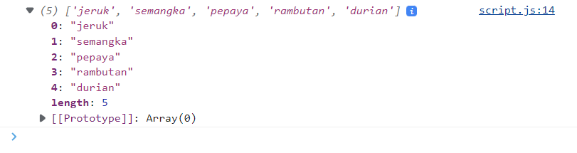
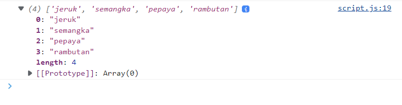
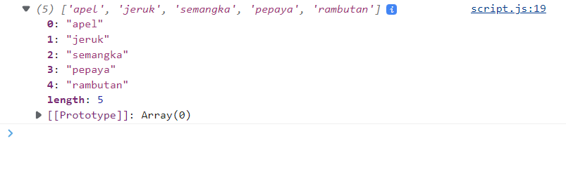
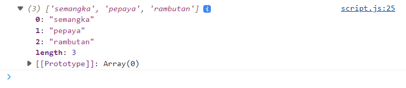
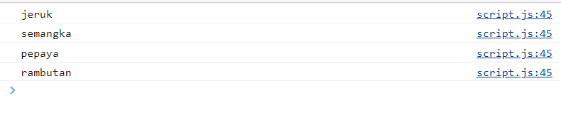
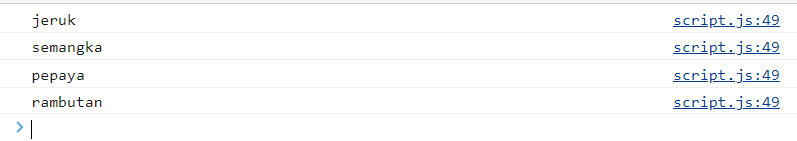
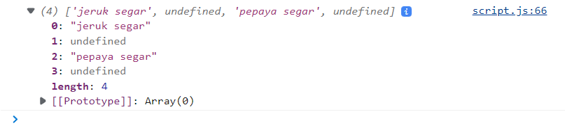
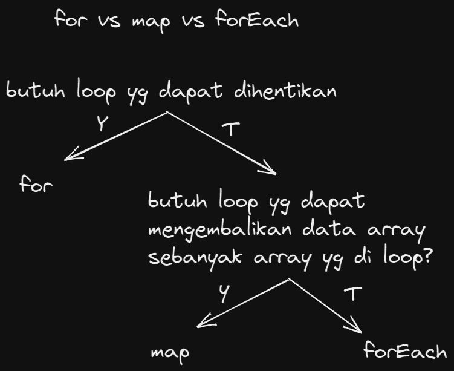
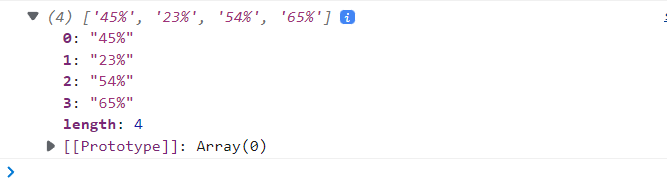
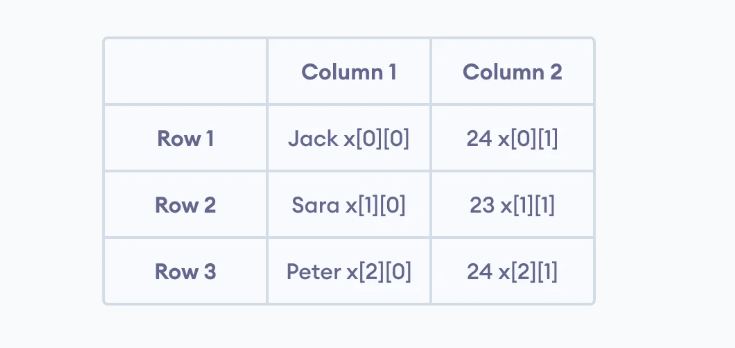

# Summary
```
Minggu 3 Web Development
Nama  : Salsabilla Pramudita
Track : FrontEnd Web Development
```
Materi :
- JavaScript intermediate - Array & Multidimensional Array
- JavaScript Intermediate - Object & Array of Object
- JavaScript Intermediate - Rekursif dan JavaScript Intermediate - Modules
- JavaScript Intermediate - Web Storage
- JavaScript Intermediate - Asynchronous - Introduction dan JavaScript Intermediate - Asynchronous - Promise


### Day 1 JavaScript intermediate - Array & Multidimensional Array

#### Array
Array di dalam Javascript mampu menyimpan banyak data dengan tipe data yang berbagai macam
- **Cara Membuat Array**
    ```
    let arr = ["hallo", 1, "true"]
    ```
- **Cara akses Array** 
    ```
    console.log(arr)
    ```
    berdasarkan index
    ```
    console.log(arr[1]) //output 1
    ```
- **Array Properties**
   - length\
        length berfungsi untuk menjumlahkan banyak array
    ```
    console.log(arr.length)
    ```
   - push()\
        Menambahkan elemen baru ke akhir array, dan mengembalikan panjang baru
      ```
      let arrBuah = ["jeruk","semangka", "pepaya", "rambutan"]

       arrBuah.push("durian")//
      ```
      output
      
      \
      bisa dilihat dari codingan dan hasilnya, di array arrBuah kita tidak menambahkan "durian", dengan push() kita bisa menambahkan data "durian", perlu diperhatikan push() hanya bisa menambahkan data diposisi akhir. 
      
   - pop()\
        Menghapus elemen terakhir dari array, dan mengembalikan elemen itu\
        ```
        arrBuah.pop()
        console.log(arrBuah)
        ```
        output
      
      \
      output yang dihasilkan adalah seperti gambar diatas, yang mana data "durian" yang kita push sebelumnya sudah terhapus, beginilah cara kerja pop()
        
   - unshift()        
        Menambahkan elemen baru ke awal array, dan mengembalikan panjang baru\
        ```
        arrBuah.unshift("apel")
        console.log(arrBuah)
        ```
       output
      
      \
      pada gambar diatas terdapat "apel", yang mana itu kita dapatkan dari properti unshift
      
   - shift()        
        Menghapus elemen pertama dari array, dan mengembalikan elemen itu
        ```
         arrBuah.shift()
         console.log(arrBuah)
        ```
      output
      
      \
      dari gambar diatas, element pertama sudah hilang, itu karna properti shift looh
   - splice()\
      Menambahkan/Menghapus elemen dari array
      ```
      arrBuah.splice(2, 0, "buah pisang")
      ```
      splice, merubah data arraynya dan dapat mereturn nilai
   - slice()\
        Memilih bagian dari array, dan mengembalikan array baru
      ```
      let slice = arrBuah.slice(2, 4)
      console.log(arrBuah)
      console.log(slice)      
      ```
      mengambil data dengan cara men-copy
  
 **Looping pada Array**
 
- For Of\
    JavaScript untuk pernyataan loop melalui nilai-nilai objek yang dapat diubah. Ini memungkinkan Anda mengulang struktur data yang dapat diubah seperti Array, Strings, Maps, NodeLists, dan banyak lagi
    ```
        for (variable of iterable) {
      // code block to be executed
    }    
    ```
    
    contoh 
    ```
    let arrBuah = ["jeruk","semangka", "pepaya", "rambutan"]
    
    for(let buah of arrBuah){
    console.log(buah)
    }
    ```
    
    output
    
    \
    
  
- For Each
    
    Metode forEach() memanggil fungsi untuk setiap elemen dalam array.

    Metode forEach() tidak dijalankan untuk elemen kosong
    
    ```
    array.forEach(function(currentValue, index, arr), thisValue)    
    ```
    contoh
    ```
     let arrBuah = ["jeruk","semangka", "pepaya", "rambutan"]
      arrBuah.forEach((item) => {
      console.log(item)
    })
    ```
    output
    
    \
    
- Map
    map() membuat array baru dari memanggil fungsi untuk setiap elemen array.

    map() memanggil fungsi sekali untuk setiap elemen dalam array.

    map() tidak menjalankan fungsi untuk elemen kosong.

    map() tidak mengubah array asli
    
    ```
    array.map(function(currentValue, index, arr), thisValue)
    ```
    contoh 
    ```
        let Buah = arrBuah.map((item, index) => {
        if(index % 2 === 0){
        return item + " "+ "segar"
        }
    })

     console.log(Buah)

    ```
    output
    
    \
    
    bisa dilihat dari gambar diatas map bisa mereturn array
  
**Perbedaan Looping pada array**


\


**Contoh Kasus**
Merubah angka desimal menjadi persen

- menggunakan map
    ```
    let angkaDes = [
        0.45,
        0.23,
        0.54,
        0.65,
    ]

    let angkaPersen = angkaDes.map((item) => {
        return item * 100 + "%"

    })   
     console.log(angkaPersen)
    ```
    
- menggunakan for each
    ```
    let angkaPersenforEach= []
    angkaDes.forEach((item) => {
        angkaPersenforEach.push(item * 100 + "%")

    })
    console.log(angkaPersenforEach)

    ```
    
    Kasus seperti ini lebih baik menggunakan map
    
    output
    
    \
    
 #### Multidimensional Array
 Multidimensional Array bisa dianalogikan dengan array of array. Ada array didalam array
 
 \
 

    
