```
Minggu ke 4 
Nama : Salsabilla Pramudita
Track : FrontEnd Web Development
```

Materi : 
- JavaScript Intermediate - Asynchronous - Fetch dan JavaScript Intermdiate - Asynchronous - Async Await
- Git & Github Lanjutan
- Responsive Web Design dan Bootstrap 5


### Day 1 JavaScript Intermediate - Asynchronous - Fetch dan JavaScript Intermdiate - Asynchronous - Async Await

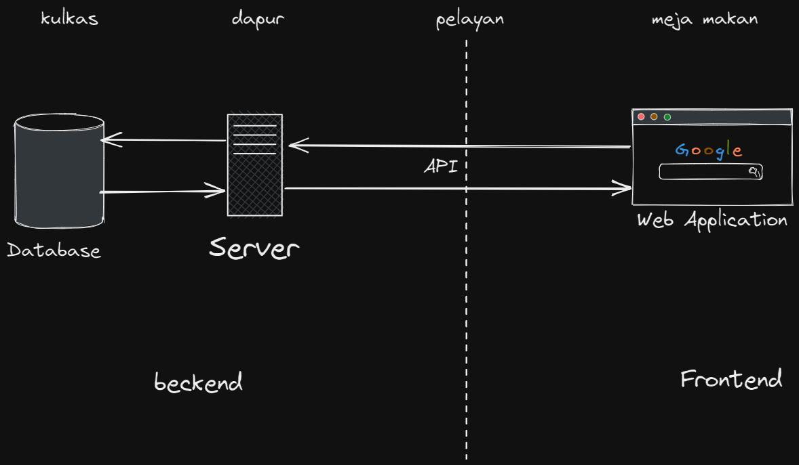\
Dari gambar diatas, disini terjadinya proses kolaborasi antar frontEnd dan BackEnd, yang mana di sisi frontEnd itu meminta data ke Server, server meminta data ke Database. dan selanjutnyasi Database(tempat berkumpulnya semua data) mengirim data ke server, lalu server yang akan meneruskan ke frontend(app). disini kita butuh API sebagai perantara. dan biasanya data nya itu bertipe data JSON\
- API\
  API  atau application programming interface adalah sebuah interface yang bisa menghubungkan dua atau lebih aplikasi secara bersamaan dan membuat pemrograman jauh lebih mudah.
- JSON\
  JSON singkatan dari JavaScript Object Notation, adalah suatu format ringkas pertukaran data komputer. bentuk JSON ini sama seperti object tetapi ada tanda kutip diantaranya
    ```js
    {
  "employees":[
    {"firstName":"John", "lastName":"Doe"},
    {"firstName":"Anna", "lastName":"Smith"},
    {"firstName":"Peter", "lastName":"Jones"}
  ]
  }
  ```
- membuat object promise
    ```js
    
        let makan = (kondisi) => {
          return new Promise((resolve, reject) => {
            if (kondisi == "lapar") {
              resolve("ayo makan")
            }
            reject("tidur")
          })
        }
    ```
- Contoh menangkap object dengan Promise
    ```js
    // //contoh promise
    makan("lapar").then(result => {
      console.log(result)
    }).catch(err => {
      console.log(err)
    })
    ```
 - contoh menangkap object dengan Asyncrounous await di Javascripts
    ```js
     async function asyncMakan() {
      let result = await makan("lapar")
      console.log(result)

    }
    ```
    pada codingan diaatas await bisa jalan karna adanya function async
 - contoh async await jika ada kondisi
     ```js
     async function asyncMakan() {
      try{
        let result = await makan()
        console.log(result)  
      } catch (error) {
        console.log(error)
      }
      }
     ```  
  
- Asyncronous fetch di Javascript\
  Fetch API adalah alat default untuk membuat jaringan dalam aplikasi web. Meskipun umumnya mudah digunakan, ada beberapa nuansa yang harus diperhatikan. Fetch API pada javascript merupakan kegiatan untuk meminta/request layanan ke endpoint/letak url yang akan menerima request pada website secara local maupun public, untuk mengambil response resource / sumber daya berupa data berformat json atau text yang biasa dilakukan programmer untuk membangun website yang membutuhkan data dari website lain.
    ```js
   fetch('http://www.omdbapi.com/?apike=7dbd864d&s=john')
    console.log( dataApi )
    ```
 codingan diatas hasilnya adalah “promise”, supaya kita dapatkan data JSON yang kita mau, kita bisa tambahkan “then” 
   ```js
    fetch('http://www.omdbapi.com/?apikey=7dbd864d&s=john')
    .then(result => {return result.json()})
    .then(result => {console.log(result)});
   ```
 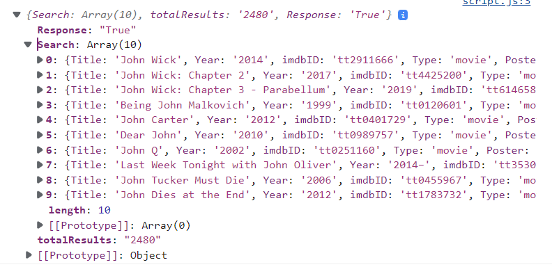\
 maka hasilnya seperti gambar diatas.
 
 menggunakan async await
   ```js
   let getDataOmdb = async() => {
    let response = await fetch("http://www.omdbapi.com/?apikey=7dbd864d&s=john")
    let result = await response.json()
    console.log(result)
  }
  getDataOmdb()
   ```
   
  - contoh mengambil data API Digimon
    - codingan html
     ```html
      <!DOCTYPE html>
      <html lang="en">
      <head>
          <meta charset="UTF-8">
          <meta http-equiv="X-UA-Compatible" content="IE=edge">
          <meta name="viewport" content="width=device-width, initial-scale=1.0">
          <title>Document</title>
          <script src="script.js" defer></script>
      </head>
      <body>

          <div id="list-digimon">
          </div>


      </body>
      </html>
     ```
    - codingan js
    ```js
    containerDigimon = document.getElementById("list-digimon")

    let getDataDigimon = async() => {
      let URL = "https://digimon-api.vercel.app/api/digimon"
      let response = await fetch(URL)
      let digimon = await response.json()

    digimon.forEach(item => {
        console.log(item)
        containerDigimon.innerHTML +=
          `<div>
          
          <h3>${item.name}</h3>
          </div>`
      });


    }
    getDataDigimon()
    
    ```
    output
    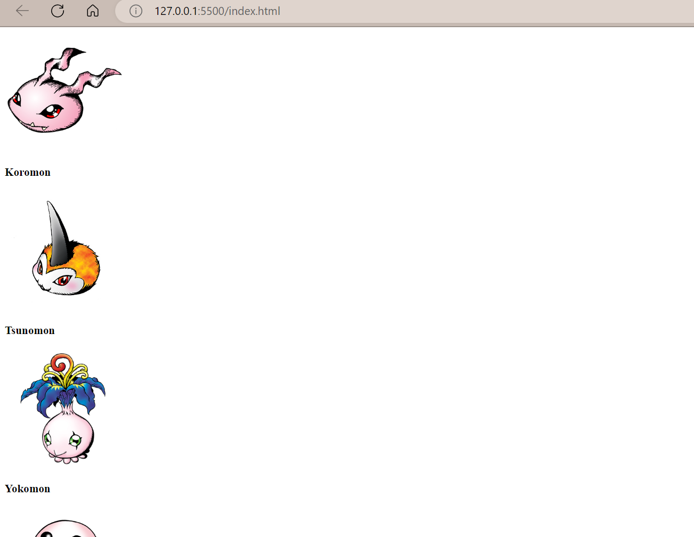
    
    apabila kita mau mengambil 10data saja, bisa memkai script dibawah
    ```
     containerDigimon = document.getElementById("list-digimon")

    let getDataDigimon = async() => {
      let URL = "https://digimon-api.vercel.app/api/digimon"
      let response = await fetch(URL)
      let digimon = await response.json()

    digimon.slice(0, 10).forEach((item, index) => {

        containerDigimon.innerHTML +=
          `<div>
          
          <h3>${item.name}</h3>
          </div>`
      });


    }
    getDataDigimon()
    
    ```
    hasilnya akan ada 10 data   
    
    
 
**Day 2 Git & Github Lanjutan**

#### Kenapa Git dan Github tools yang wajib digunakan?
Karena kedua platform ini sangat membantu pekerjaan programmer dalam menyusun kode script secara grup/tim. Seluruh pekerjaan juga dapat dipantau dan dievaluasi dengan mudah karena penggunaan kontrol sistem.

**GIT**
Git adalah aplikasi yang dapat melacak setiap perubahan yang terjadi pada suatu folder atau file.

**GitHub**
GitHub adalah layanan cloud yang berguna untuk menyimpan dan mengelola sebuah project yang dinamakan repository.

**Perbedaan Git & GitHub**
| Git | GitHub |
| ------ | ------ |
| diakses secara offline | diakses secara online |
| di-install pada penyimpananan lokal | melalui layanan cloud |
| sebagai control version system | sebagai source code hosting |
| open source | pilihan bagi pengguna gratis dan berbayar |

**Membuat Repository pada GIT**
- login github
- create repository
   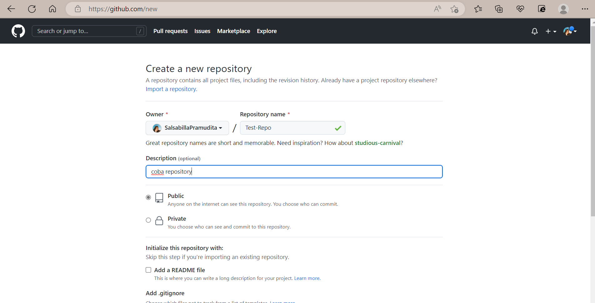
- create folder di file explorer dan buatlah file yang akan kita masukkan ke git
  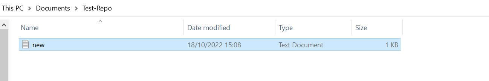
- klik kanan pada file tersebut lalu pilih gitbash, berikut syntax yang akan kita eksekusi
    - ```git init```, syntak disamping berfungsi untuk membuat repository baru.
      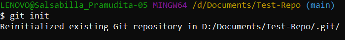
      
    - ```git remote add origin https://github.com/SalsabillaPramudita/Test-Repo.git```. Remote repository berfungsi untuk mengupload file yang telah Anda buat sebelumnya         di local disk
       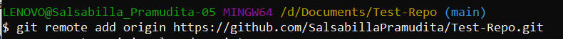
       
**Commit pada GIT**

      -  ```git add .```, gunakan syntax ini untuk menambahkan beberapa atau semua file yang akankita masukkan kedalam folder.
          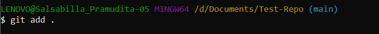

      -  ```git commit```, Lakukan ‘git commit’ untuk save perubahan pada version control
          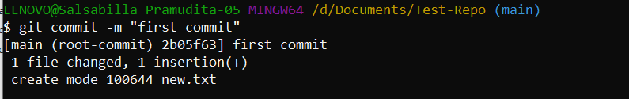

      -  ```git push -u origin main`` digunakan untuk mengirimkan/perubahan file ke remote repository
          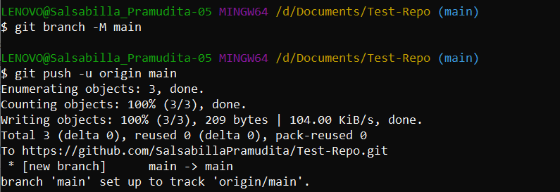

      - hasilnya
          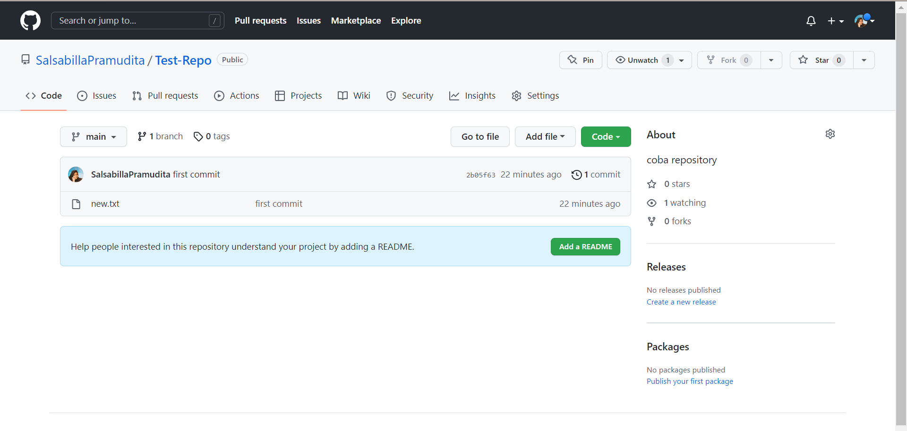
    
**Day 3  Responsive Web Design dan Bootstrap 5**

