```
Minggu ke 4 
Nama : Salsabilla Pramudita
Track : FrontEnd Web Development
```

Materi : 
- JavaScript Intermediate - Asynchronous - Fetch dan JavaScript Intermdiate - Asynchronous - Async Await
- Git & Github Lanjutan
- Responsive Web Design dan Bootstrap 5


### Day 1 JavaScript Intermediate - Asynchronous - Fetch dan JavaScript Intermdiate - Asynchronous - Async Await

\
Dari gambar diatas, disini terjadinya proses kolaborasi antar frontEnd dan BackEnd, yang mana di sisi frontEnd itu meminta data ke Server, server meminta data ke Database. dan selanjutnyasi Database(tempat berkumpulnya semua data) mengirim data ke server, lalu server yang akan meneruskan ke frontend(app). disini kita butuh API sebagai perantara. dan biasanya data nya itu bertipe data JSON\
- API\
  API  atau application programming interface adalah sebuah interface yang bisa menghubungkan dua atau lebih aplikasi secara bersamaan dan membuat pemrograman jauh lebih mudah.
- JSON\
  JSON singkatan dari JavaScript Object Notation, adalah suatu format ringkas pertukaran data komputer. bentuk JSON ini sama seperti object tetapi ada tanda kutip diantaranya
    ```js
    {
  "employees":[
    {"firstName":"John", "lastName":"Doe"},
    {"firstName":"Anna", "lastName":"Smith"},
    {"firstName":"Peter", "lastName":"Jones"}
  ]
  }
  ```
- membuat object promise
    ```js
    
        let makan = (kondisi) => {
          return new Promise((resolve, reject) => {
            if (kondisi == "lapar") {
              resolve("ayo makan")
            }
            reject("tidur")
          })
        }
    ```
- Contoh menangkap object dengan Promise
    ```js
    // //contoh promise
    makan("lapar").then(result => {
      console.log(result)
    }).catch(err => {
      console.log(err)
    })
    ```
 - contoh menangkap object dengan Asyncrounous await di Javascripts
    ```js
     async function asyncMakan() {
      let result = await makan("lapar")
      console.log(result)

    }
    ```
    pada codingan diaatas await bisa jalan karna adanya function async
 - contoh async await jika ada kondisi
     ```js
     async function asyncMakan() {
      try{
        let result = await makan()
        console.log(result)  
      } catch (error) {
        console.log(error)
      }
      }
     ```  
  
- Asyncronous fetch di Javascript\
  Fetch API adalah alat default untuk membuat jaringan dalam aplikasi web. Meskipun umumnya mudah digunakan, ada beberapa nuansa yang harus diperhatikan. Fetch API pada javascript merupakan kegiatan untuk meminta/request layanan ke endpoint/letak url yang akan menerima request pada website secara local maupun public, untuk mengambil response resource / sumber daya berupa data berformat json atau text yang biasa dilakukan programmer untuk membangun website yang membutuhkan data dari website lain.
    ```js
   fetch('http://www.omdbapi.com/?apike=7dbd864d&s=john')
    console.log( dataApi )
    ```
 codingan diatas hasilnya adalah “promise”, supaya kita dapatkan data JSON yang kita mau, kita bisa tambahkan “then” 
   ```js
    fetch('http://www.omdbapi.com/?apikey=7dbd864d&s=john')
    .then(result => {return result.json()})
    .then(result => {console.log(result)});
   ```
 \
 maka hasilnya seperti gambar diatas.
 
 menggunakan async await
   ```js
   let getDataOmdb = async() => {
    let response = await fetch("http://www.omdbapi.com/?apikey=7dbd864d&s=john")
    let result = await response.json()
    console.log(result)
  }
  getDataOmdb()
   ```
   
  - contoh mengambil data API Digimon
    - codingan html
     ```html
      <!DOCTYPE html>
      <html lang="en">
      <head>
          <meta charset="UTF-8">
          <meta http-equiv="X-UA-Compatible" content="IE=edge">
          <meta name="viewport" content="width=device-width, initial-scale=1.0">
          <title>Document</title>
          <script src="script.js" defer></script>
      </head>
      <body>

          <div id="list-digimon">
          </div>


      </body>
      </html>
     ```
    - codingan js
    ```js
    containerDigimon = document.getElementById("list-digimon")

    let getDataDigimon = async() => {
      let URL = "https://digimon-api.vercel.app/api/digimon"
      let response = await fetch(URL)
      let digimon = await response.json()

    digimon.forEach(item => {
        console.log(item)
        containerDigimon.innerHTML +=
          `<div>
          
          <h3>${item.name}</h3>
          </div>`
      });


    }
    getDataDigimon()
    
    ```
    output
    
    
    apabila kita mau mengambil 10data saja, bisa memkai script dibawah
    ```
     containerDigimon = document.getElementById("list-digimon")

    let getDataDigimon = async() => {
      let URL = "https://digimon-api.vercel.app/api/digimon"
      let response = await fetch(URL)
      let digimon = await response.json()

    digimon.slice(0, 10).forEach((item, index) => {

        containerDigimon.innerHTML +=
          `<div>
          
          <h3>${item.name}</h3>
          </div>`
      });


    }
    getDataDigimon()
    
    ```
    hasilnya akan ada 10 data   
    
    
 
**Day 2 Git & Github Lanjutan**

#### Kenapa Git dan Github tools yang wajib digunakan?
Karena kedua platform ini sangat membantu pekerjaan programmer dalam menyusun kode script secara grup/tim. Seluruh pekerjaan juga dapat dipantau dan dievaluasi dengan mudah karena penggunaan kontrol sistem.

**GIT**
Git adalah aplikasi yang dapat melacak setiap perubahan yang terjadi pada suatu folder atau file.

**GitHub**
GitHub adalah layanan cloud yang berguna untuk menyimpan dan mengelola sebuah project yang dinamakan repository.

**Perbedaan Git & GitHub**
| Git | GitHub |
| ------ | ------ |
| diakses secara offline | diakses secara online |
| di-install pada penyimpananan lokal | melalui layanan cloud |
| sebagai control version system | sebagai source code hosting |
| open source | pilihan bagi pengguna gratis dan berbayar |

**Membuat Repository pada GIT**
- login github
- create repository
   
- create folder di file explorer dan buatlah file yang akan kita masukkan ke git
  
- klik kanan pada file tersebut lalu pilih gitbash, berikut syntax yang akan kita eksekusi
    - ```git init```, syntak disamping berfungsi untuk membuat repository baru.
      
      
    - ```git remote add origin https://github.com/SalsabillaPramudita/Test-Repo.git```. Remote repository berfungsi untuk mengupload file yang telah Anda buat sebelumnya di local disk
       
       
**Commit pada GIT**

-  ```git add .```, gunakan syntax ini untuk menambahkan beberapa atau semua file yang akankita masukkan kedalam folder.      
          

-  ```git commit```, Lakukan ‘git commit’ untuk save perubahan pada version control
          
- ```git push -u origin main``` digunakan untuk mengirimkan/perubahan file ke remote repository
          
          
- hasilnya
          
          
**Membuat Organization**
- Klik New organization pada kanan atas 
 

- lalu tuliskan nama dari organisasi yang akan dibuat
- invite anggota tim
   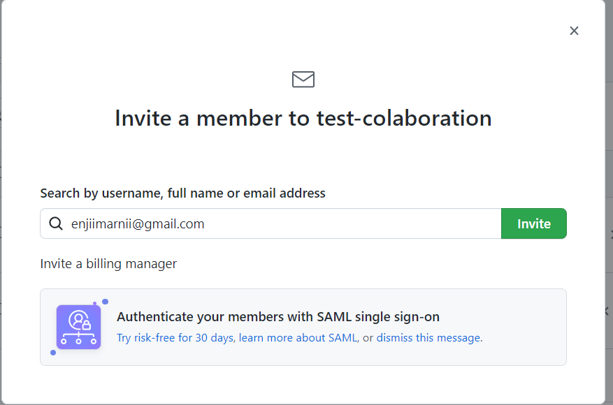
   
 **Membuat Repository dan Branch di Organization**
 - Klik repository
  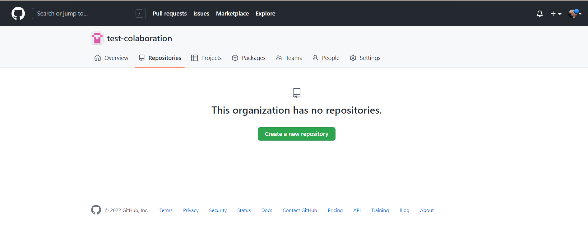
  
 - Buat nama repository  
   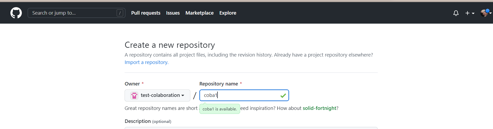
   
 - add file
   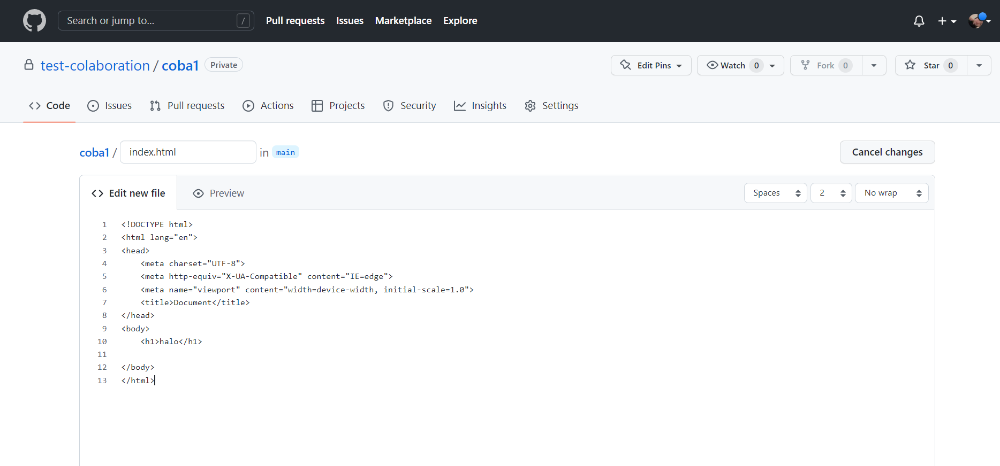
    
 - file berhasil terbuat
   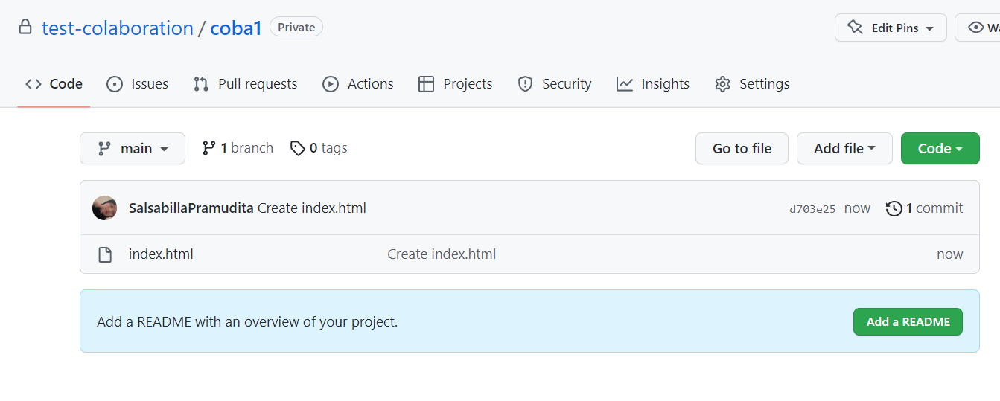
  
  - membuat branch dev
   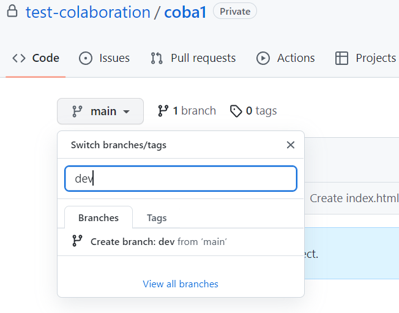
  
  - status branch
   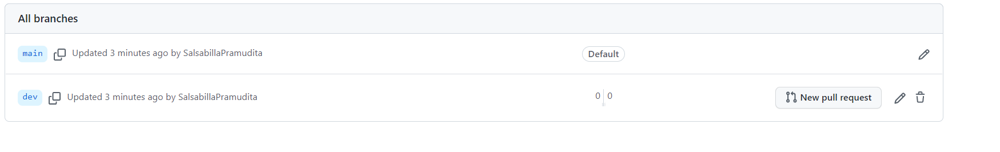
   
  - clone repository
   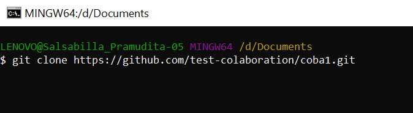
   
   - mengganti branch
   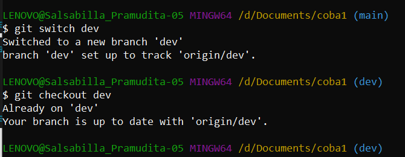
   
   - membuat branch baru di git bash
   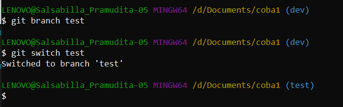
   
   - buatlah file baru yang akan kita commit
   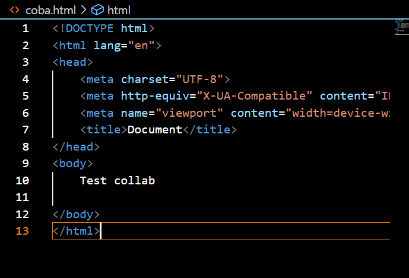
   
   - tambahkan file dan commit
   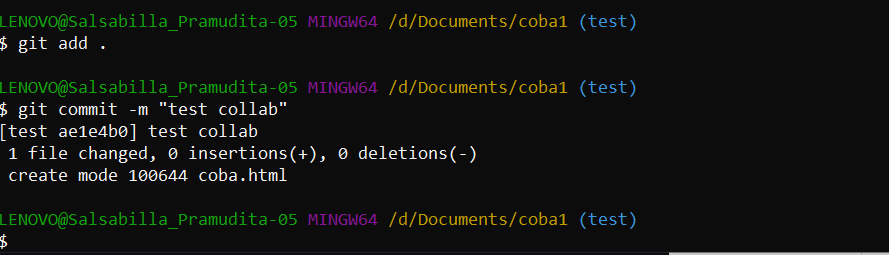   
   
   - lalu push ke repository
   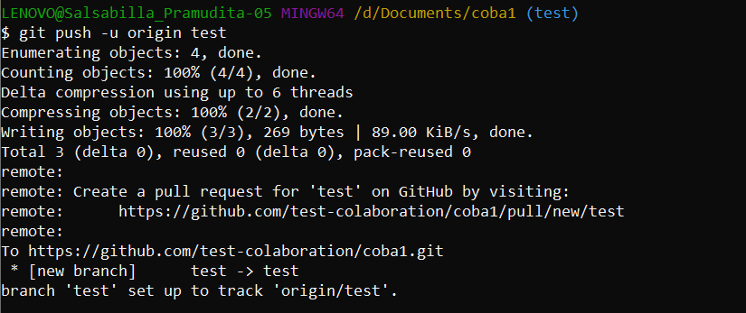
   
   - file berhasil di push ke github, lalu klik compare & pull request
   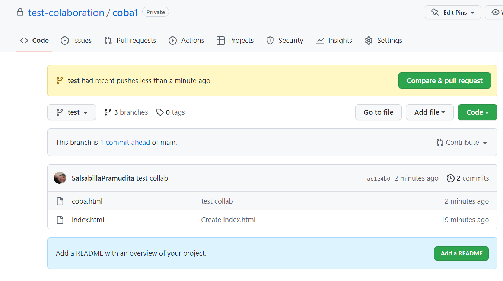
   
   - create pull request
  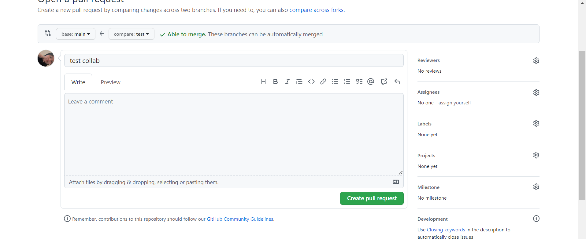
  
  - merge pull request
    **Merge pada GIT**\
Merge adalah suatu command dalam git untuk membuat branch yang bercabang menjadi satu kembali atau dengan kata lain mengintegrasikan kembali branch tersebut menjadi satu. Merge akan mengombinasikan beberapa tahapan commits menjadi satu branch yang terunifikasi
   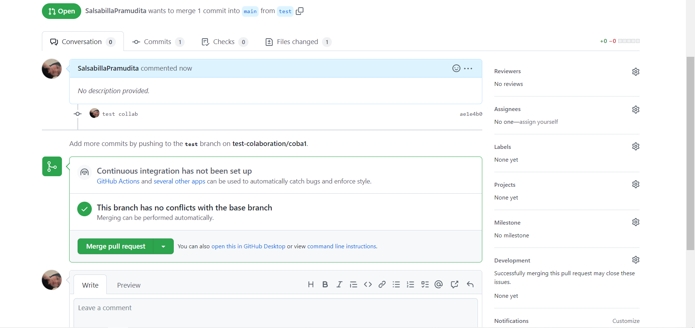

   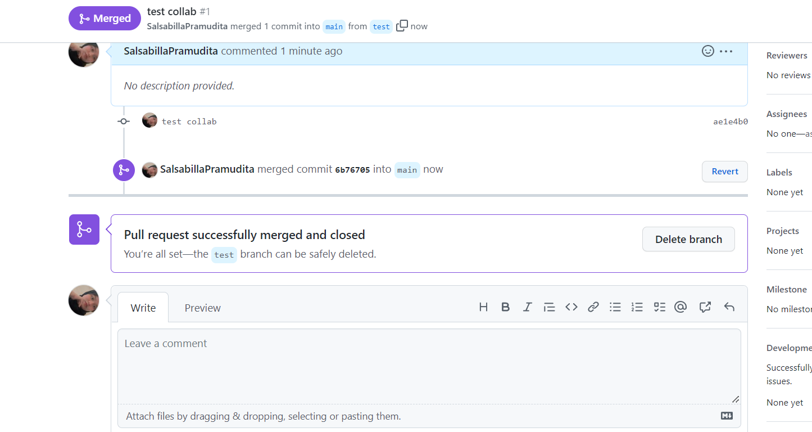

 

- conflict di github\
  Sebagai contoh, misal kamu sedang mengerjakan fitur A, dan teman kamu mmengerjakan fitur B. Setelah beberapa hari kamu berhasil menyelesaikan fitur A tersebut namun ketika ingin menggabungkan/merge dengan master branch ternyata git menolak karena adanya konflik yang terjadi dikarenakan teman kamu sudah lebih dulu melakukan merge dan ada sebagian perubahan dari content/file yang kamu juga telah kerjakan.

Jadi git menginginkan agar branch kamu dapat di merge dengan master branch maka kamu perlu melakukan resolve conflict.
Disinilah git rebase bisa menjadi solusi.

    ```
    git checkout master
    git pull
    git checkout fitur_a
    git rebase
    ```
    
 Disini git akan menginformasikan letak konflik dan kamu perlu meyelesaikan itu.
Edit file yang memiliki konflik tersebut. Setelah selesai:

    ```
    git add <nama file>
    git status
    git rebase --continue
    git checkout master
    ```

Apabila sebelumnya branch fitur_a ini sudah menjadi pull_request yang ada di remote repository maka kamu bisa lakukan force push:
git push -f <remote name> fitur_a
    
**Day 3  Responsive Web Design dan Bootstrap 5**
  
  **Responsive Web Design**
Responsive Web Design adalah cara membuat website kamu menjadi menarik di berbagai jenis device

  - Viewport
    ```
    <meta name="viewport" content="width=device-width, initial-scale=1.0">  
    ```
    Dari codingan diatas dapat kita lihat atribut content memiliki beberapa variabel untuk viewport
      - ```width``` untuk mengatur lebar halaman, jika membarikan nilai device-width maka lebar akan mengikuti ukuran lebar dari perangkat;
initial-scale adalah variabel untuk mengatur sekala (z00m) dari halaman web
      - ```initial scale```adalah variabel untuk mengatur sekala (z00m) dari halaman web.
  
  - Relative CSS Unit\
    Halaman harus dapat menyesuaikan setiap ukuran yang kita tampilkan pada layar peranti yang berbeda-beda. Dengan menggunakan relative units, tampilan akan dapat mudah menyesuaikan dengan keadaan layar.
  
  Contohnya kita ingin membuat sebuah elemen div dengan lebar sesuai dengan viewport pada browser. Kita bisa saja berasumsi dengan menerapkan  lebar 1000px, misalnya, karena nilai tersebut cukup lebar untuk berbagai layar peranti. Maka kita menuliskan css seperti berikut:
  ``` 
    .container {
        width: 1000px;
        min-height: 200px;
    }
  ```
  
- Typography Units\
Dalam penerapan font, kita juga perlu menggunakan satuan relatif seperti em, rem, vw dan vh. Satuan tersebut dapat menyesuaikan ketika ukuran layar atau ukuran font itu sendiri diubah.

    - em : Satuan relatif terhadap ukuran font sebuah elemen (2em berarti 2 kali ukuran font saat ini)
    - ex: Satuan relatif terhadap tinggi font saat ini, satuan ini sangat jarang sekali digunakan.
    - ch: Satuan relatif terhadap lebar dari karakter “0” nol.
    - rem: Mirip seperti em, tetapi rem merupakan Satuan relatif terhadap ukuran font dari root element.
    - vw:  Satuan relatif terhadap 1% lebar viewport. Contoh 1vw = 1% dari lebar viewport. Satuan ini tidak support pada IE8 ke bawah.
    - vh: Satuan relatif terhadap 1% tinggi viewport. Contoh 1vh = 1% dari tinggi viewport. Satuan ini tidak support pada IE8 ke bawah.

  contoh codingan penggunaan unit relative dengan vw pada font\
      ```
        <!DOCTYPE html>
      <html lang="en">
      <head>
          <meta charset="UTF-8">
          <title>responsive web</title>
          <meta name="viewport" content="width=device-width, initial-scale=1">
          <style>
              .container h1 {
                  font-size: 8vw;
              }
          </style>
      </head>
      <body>
      <div class="container">
          <h1>Dummy Text</h1>
          <p>Lorem Ipsum adalah contoh teks atau dummy dalam industri percetakan dan penataan huruf atau typesetting.
              Lorem Ipsum telah menjadi standar contoh teks sejak tahun 1500an, saat seorang tukang cetak yang tidak dikenal
              mengambil sebuah kumpulan teks dan mengacaknya untuk menjadi sebuah buku contoh huruf. Ia tidak hanya bertahan
              selama 5 abad, tapi juga telah beralih ke penataan huruf elektronik, tanpa ada perubahan apapun. Ia mulai
              dipopulerkan pada tahun 1960 dengan diluncurkannya lembaran-lembaran Letraset yang menggunakan kalimat-kalimat
              dari Lorem Ipsum, dan seiring munculnya perangkat lunak Desktop Publishing seperti Aldus PageMaker juga memiliki
              versi Lorem Ipsum.</p>
      </div>
      </body>
      </html>
      ```
  
  contoh codingan relativ unit
  ```html
    <!DOCTYPE html>
  <html lang="en">
  <head>
      <meta charset="UTF-8">
      <meta http-equiv="X-UA-Compatible" content="IE=edge">
      <meta name="viewport" content="width=device-width, initial-scale=1.0">
      <title>Document</title>
      <link rel="stylesheet" href="style.css">
  </head>
  <body>
      <div class="container">
          <p class="rem">hallo ini dari rem</p>
        </div>

        <div class="container">
          <p class="em">hallo ini dari em</p>
        </div>

  </body>
  </html>
  ```
  
  ```css
  .rem {
    font-size: 2rem;
  }
  
  .em {
    font-size: 2em;
  } 
  ```
  
  - media query\
  berguna membuat layout kita responsive dengan menyesuaikan tampilan berdasarkan ukuran layar perangkat. 
  
  contoh media query
  ```html
  
  @media only screen and (min-width: 400px) {
    p { 
  background: red; 
  color: white;
  }  
  ```
  
 - flexbox
  Flexbox merupakan konsep pengaturan layout yang mengatur ukuran elemen Child dari suatu Container untuk beradaptasi dengan Parent/Container-nya. Flexbox umumnya digunakan pada sebuah elemen yang tidak pasti ukurannya atau berubah-ubah(dinamis). Hal ini sangat bermanfaat untuk membuat tampilan website responsif.
  
  
  contoh codingan
  ```html
    <!DOCTYPE html>
    <html lang="en">
      <head>
        <meta charset="UTF-8" />
        <meta http-equiv="X-UA-Compatible" content="IE=edge" />
        <meta name="viewport" content="width=device-width, initial-scale=1.0" />
        <link rel="stylesheet" href="style.css" />
        <title>Document</title>
      </head>
      <body>
        <h1>Flex Container</h1>

        <div class="flex-container">
          <div>a</div>
          <div>b</div>
          <div>c</div>
          <div>d</div>

        </div>

          </body>
    </html>
  ```
  codingan css
    ``css
      .flex-container {
      display: flex;
      background-color: rgb(128, 30, 0);
    }

    .flex-container > div {
      background-color: #f1f1f1;
      margin: 10px;
      padding: 20px;
      font-size: 30px;
    }
    ```
