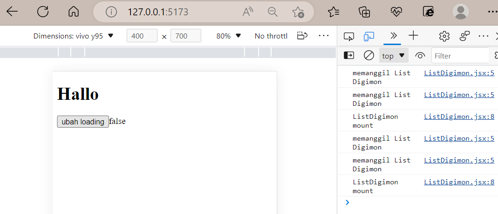

# WEEK 6

Nama : Salsabilla Pramudita\
Track : FrontEnd Development\
Week 1 Front End Bootcamp

Materi : 
- Day 1 React.js Basic - JavaScript for React.js dan React.js Basic - Intro to React.js, Virtual DOM, and JSX
- Day 2 React.js Basic - Functional Component, React.js Basic - Props and State,  React.js Basic - Styling (CSS Stylesheet, CSS Modules & CSS-in-JS)
- Day 3 React.js Basic - Handling Events, React.js Basic - Conditional Rendering
- Day 4  React.js Lanjutan - Lifecycle Method dan React.js Lanjutan - Hooks
- Day 5 React.js Basic - Forms

### Day 1 React.js Basic - JavaScript for React.js dan Intro to React.js, Virtual DOM, and JSX
- React.Js\
  Adalah Framework view library javascript untuk membuat tampilan (user interface) pada website. React memungkinkan untuk membuat UI kompleks dari kumpulan kode yang kecil dan terisolasi yang disebut “komponen”.
  
- Kenapa menggunakan React.js?
    - Performa\
      ReactJS menggunakan kerangka VDOM yang membuat aplikasi web berjalan lebih cepat. Dengan kerangka ini, antarmuka pengguna yang kompleks dapat dipecah menjadi beberapa komponen. Dengan begitu, proses pengembangan bisa berjalan lebih cepat karena memungkinkan banyak pengguna bekerja pada komponen secara bersamaan
    
    - Modular\
      dengan React kita dapat menerapkan konsep modular Javascript pada. React JS membagi 1 tampilan website menjadi komponen-komponen kecil
      
    - Scalable\
      React JS dapat digunakan pada aplikasi berskara kecil hingga besar dan kompleks
      
    - Popular\
      Simpel adalah salah satu alasan mengapa ReactJS cukup populer di kalangan developer. Dengan pendekatan berbasis komponen serta penggunaan Javascript yang sederhana dalam pembuatan website atau aplikasi mobile, ReactJS banyak menjadi pilihan bagi para developer.

- Installl React JS
  - Download Node.js\
    link download https://nodejs.org. nodejs adalah sebuah runtime javascript yang di buat dari v8 engine-nya chrome
  - Install Node.js\
    sangat mudah dalam penginstallan node.js ini kita tinggal next saja, lalu diakhir klik finish
  - Buat Folder\
    Setelah selesai, buat folder baru untuk instalasi react
  - Tes Node.js\
    untuk memastikan Node.js kita berhasil terinstal maka bukalah cmd dan ketikkan **npm -v**
    
  - Install React\
    install React dengan mengetik **npm install -g create-react-app**
  - Tes React\
    Untuk mengecek proses instalasinya, bisa dilakukan dengan mengetik **create-react-app –version**
  - Create Project\
    **create-react-app project-baru** (kita bisa mengganti "project-baru” dengan nama project yang lain)
     
  - Jalankan Project\
    Setelah proses pembuatan project selesai,ketikkan\
    **cd project-baru\
      npm start**\
    akan muncul halaman web yang terbuka otomatis dengan alamat localhost:3000
    
    
- Virtual DOM\
    Virtual DOM secara singkat nya adalah sebuah javascript object (virtual) yang merepresentasikan DOM yang sebenarnya (real DOM). karena virtual dom ini adalah representasi dari real dom maka virtual dom adalah sebuah replikasi (copy) dari real dom tersebut. Berbeda konsep dengan DOM, virtual dom ini memiliki konsep yaitu setiap saat perubahan terjadi di state pada aplikasi kita maka akan membuat virtual dom yang baru (cloning). Seperti terlihat pada gambar diatas, ketika ada perubahan maka virtual dom akan membuat virtual dom baru dan melakukan comparation (diffed) dari virtual dom sebelumnya. Hanya perubahan tersebut yang akan dikirim ke real dom untuk mengupdate nya. Proses seperti ini membuat virtual DOM lebih cepat dibandingkan dengan DOM, jadi tidak perlu adanya proses re-rendering lagi pada keseluruhan DOM

    \
  Pada React, setiap bagian dari UI adalah component, dan setiap component mempunyai state. React menggunakan konsep Observable Pattern dan mengamati setiap perubahan pada state. Ketika state pada sebuah component berubah, react mengupadate virtual DOM tree. Setelah virtual DOM diperbarui, React kemudian membandingkan versi sekarang virtual DOM dengan versi sebelumnya. Setelah mengetahui object pada virtual DOM mana yang berubah maka hanya object tersebutlah yang akan dirubah pada real DOM. Proses seperti membuat performance aplikasi lebih baik
  
 - JSX\
   JSX adalah sebuah sintaks tertanam, yang seperti XML. Ini dimaksudkan untuk diubah menjadi JavaScript yang valid, meskipun semantik dari transformasi itu khusus untuk implementasi. JSX perlu di compile untuk menjadi Javascript. Jadi sebelum ditampilkan pada browser, JSX akan dicompile menjadi javascipt terlebih dahulu. Dengan **JSX kita dapat menggunakan HTML didalam file extension (.js)**
    \
    
   Setiap JSX hanya bisa memiliki1 parent element
   ```js
   import React from "react";

    function App() {
      return (
      <p>hello world</p>
      <p>Aku Salsa</p>
      );
    }

    export default App;

   ```
   Codingan diatas akan muncul eror seperti dibawah ini
    \
    
    Apabila kita ingin membuat 2 parent element atau lebih , maka solusinya bisa menggunakan tag elemen div dan tag fragment
    - menggunakan div
    ```js
    import React from "react";

    function App() {
      return (
      <div>
        <p>hello world</p>
        <p>Aku Salsa</p>
      </div>
      );
    }

    export default App;
    ```
    - Menggunakan tag fragment
    ```js
    import React from "react";

    function App() {
      return (
      <>
        <p>hello world</p>
        <p>Aku Salsa</p>
      </>
      );
    }

    export default App;
    ```
    maka outputnya berhasil seperti dibawah ini
     
  
- Membuat Component\
   Component memungkinkan kita membagi User Interface (UI) menjadi bagian-bagian yang independen dan dapat digunakan kembali, dan memikirkan setiap bagian secara terpisah. Secara konseptual, komponen seperti fungsi JavaScript.\
   Component dibuat jika component tersebut bersifat reusable code. Pada skala project, buatlah component jika component tersebut dibutuhkan pada section page lain
   
   - buatlah folder baru didalam folder src\
       
     
   - buatl file didalam components, berikan huruf besar pada awal penamaan file
      disini saya membuat file bernama Home.js. didalamnya terdapat sebuah fungsi yang mana penamaan fungsi tersebut juga diawali dengan huruf kapital
      ```js
      function Home() {
        return (
          <div>
            <h1>Home</h1>
          </div>
        )
      }

      export default Home
      ```
    - memanggil file Home.js di file App.js
       
      
    - output
       
       
   ### Day 2 React.js Basic - Functional Component, Props and State, Styling (CSS Stylesheet, CSS Modules & CSS-in-JS)
   
   - Contoh codingan sederhana dengan styling css
   
   file App.js
    ```js
   import './App.css';

  function App() {
  return (
    <>

  <div className="container">
      </img>
    
          <div className='info-profile'>
            <h2>Salsa</h2>
            <h3>19 Tahun</h3>
            <p>Peserta Front End</p>
          </div>
        </div>
        </>
      );
    }

    export default App;
    ```
    
    file App.css
     ```css
      .profile-img{
    width: 150px;
    height: 150px;
    border-radius: 100%;
    overflow: hidden;
    object-fit: cover;
    }
    .info-profile{
      margin-left: 20px;

    }

    .container{
      margin-left: 100px;
      display: flex;
    }
    ```
    
    output
     
     
     dari contoh kodingan diatas adalah contoh kasus sederhana, bagaimana kita mau menampilkan banyak data?, maka solusinya membuat component yang berisikan content data tersebut, lalu nantinya kita akan panggil dari file App.js nya.
     
     \
        dari gambar diatas, saya sudah membuat folder components dan file MemberInfo.jsx. berikut codingan yang ada dalam file tersebut. 
      
    ```
      const MemberInfo= ()=>{
      return(        
      <div className="container">
      </img>

          <div className='info-profile'>
              <h2>Salsa</h2>
              <h3>19 Tahun</h3>
              <p>Peserta Front End</p>
          </div>
          </div>
          )
      }
       export default MemberInfo;          
    ```
      
    codingan diatas adalah content yang kita buat pada file App.js sebelumnya. pindahkan saja codingan html yang ada App.js tadi ke MemberInfo.jsx
      
     berikut codingan App.js
     
     ```js
       import './App.css';
       import MemberInfo from './components/Memberinfo';

        function App() {
          return (
            <>
            <MemberInfo />
            </>
          );
        }

        export default App;
        
      ```      
      
 difile App.js ini kita hanya memanggil si MemberInfo.jsx yang telah kita buat tadi. part terpentingnya ada jangan lupa menyisipkan import di bagian atas codingan.
      
 output
 
 
 jika kita mau manggil banyak data
 ```js
    import './App.css';
    import MemberInfo from './components/Memberinfo';

    function App() {
      return (
        <>
        <MemberInfo />
        <MemberInfo />
        <MemberInfo />

        </>
      );
    }

    export default App;
 ```
 
 output 
  
 
 - membuat component yang dinamis dengan props dan state
 
 **props**\
 props merupakan argumen yang di-passing dari satu komponen ke komponen lain. Cara passing props sangatlah mudah, yaitu dengan menulisnya sebagai atribut pada elemen HTML. Props digunakan untuk melakukan komunikasi data antara komponen parent dan child.\
 
 contoh props
 
  file MemberInfo.jsx
  ```
  const MemberInfo= ({name, age, info, imgUrl})=>{

    return(        
    <div className="container">
    </img>

    <div className='info-profile'>
        <h2>{name}</h2>
        <h3>{age}</h3>
        <p>{info}</p>
    </div>
    </div>
        )
    }
   export default MemberInfo;

  ```
  
  file App.js
  
  ```js
    import './App.css';
    import MemberInfo from './components/Memberinfo';

    function App() {
      return (
        <>
        <MemberInfo name={"aca"} age={20} info={"Siswa stupen Skilvul"} imgUrl={"https://img.freepik.com/free-vector/illustration-female-character-wearing-hijab-working-office_10045-686.jpg?w=740&t=st=1667142531~exp=1667143131~hmac=7c13c7625279a79bf980b75e952aaa0aebc1c672693e13b2596cfd1ead7693e1"} />

        <MemberInfo name={"adit"} age={21} info={"Siswa Akademi Polisi"} imgUrl={"https://cdn-icons-png.flaticon.com/512/1140/1140494.png?w=740&t=st=1667147325~exp=1667147925~hmac=eaf85ab253cf13ad7ceca6f4ae264c4be98341276c7881d8ed82e7e9083fc866"} />

        </>
      );
    }

    export default App;

  ```
  
  maka hasilnya seperti diabawah ini
    
    
   
 contoh stylling dengan inline css
 ```
  const MemberInfo= ({name, age, info, imgUrl})=>{

      return(        
      <div className="container">
      </img>

      <div className='info-profile'>
          <h2 style={{ color : "red" }}>{name}</h2>
          <h3>{age}</h3>
          <p>{info}</p>
      </div>
      </div>
      )
  }
      export default MemberInfo;

 ```
 
 output 
     
 
 **State**\
  State adalah sebuah object untuk menyimpan data pada React dan akan di render atau muat ulang ketika data mengalami perubahan.
     
 **useState**\
 useState di panggil dalam function component untuk menambahkan suatu state lokal. React akan menyimpan state antar render. useState memberikan dua hal: nilai state saat ini dan fungsi untuk memperbarui nilai tersebut. Anda dapat memanggil fungsi ini dari sebuah event handler atau dimanapun
 
 contoh penggunaan useState
 ```js
    import { useState } from 'react';
    import './App.css';
    import MemberInfo from './components/Memberinfo';

    function App() {
      const [name, setName]= useState("Salsa");
      const [age, setAge]= useState(19);

      return (
        <>
          <MemberInfo name={name} age={age} info={"Siswa stupen Skilvul"} imgUrl={"https://img.freepik.com/free-vector/illustration-female-character-wearing-hijab-working-office_10045-686.jpg?w=740&t=st=1667142531~exp=1667143131~hmac=7c13c7625279a79bf980b75e952aaa0aebc1c672693e13b2596cfd1ead7693e1"} nameColor={"red"} />

          <br />
          <button onClick={()=> setName("aca")}>Change Name</button>;
          <button onClick={()=> setAge(age + 1)}>Change Age</button>;
        </>
      );
    }

    export default App;

 ```
 
 output
 
 
 bisa dilihat dari gambar diaatas terdapat sebuah buttonclick yang berfungsi merubah sebuah atribut
 
 - Bootstrap di React 
  
 **Memakai getbootstrap**\
  
  - memasang bootstrap di file index.html
  
  ```html
  <!DOCTYPE html>
  <html lang="en">
    <head>
      <meta charset="utf-8" />
      <link rel="icon" href="%PUBLIC_URL%/favicon.ico" />
      <meta name="viewport" content="width=device-width, initial-scale=1" />
      <meta name="theme-color" content="#000000" />
      <meta
        name="description"
        content="Web site created using create-react-app"
      />
      <link rel="apple-touch-icon" href="%PUBLIC_URL%/logo192.png" />
 
      <title>React App</title>
      
      <link href="https://cdn.jsdelivr.net/npm/bootstrap@5.2.2/dist/css/bootstrap.min.css" rel="stylesheet" integrity="sha384-Zenh87qX5JnK2Jl0vWa8Ck2rdkQ2Bzep5IDxbcnCeuOxjzrPF/et3URy9Bv1WTRi" crossorigin="anonymous" /> <!-- Bootstrap CSS -->
    </head>
    <body>
      <script src="https://cdn.jsdelivr.net/npm/bootstrap@5.2.2/dist/js/bootstrap.bundle.min.js" integrity="sha384-OERcA2EqjJCMA+/3y+gxIOqMEjwtxJY7qPCqsdltbNJuaOe923+mo//f6V8Qbsw3" crossorigin="anonymous"></script>
    </body>
  </html>

  ```
  
  - mengubah background dari container
  ```
  const MemberInfo= ({name, age, info, imgUrl, nameColor})=>{

      return(        
      <div className="container bg-warning">
      </img>

      <div className='info-profile'>
          <h2 style={{ color : nameColor }}>{name}</h2>
          <h3>{age}</h3>
          <p>{info}</p>
      </div>
      </div>
      )
  }
      export default MemberInfo;

  ```
  
  - Output
   
   
   nah darigambar diatas bootsrap sudah berhasil kita pasang
   
   - Membuat file Navbar.jsx di folder components\
     pada file Navbar ini kita copy saja codingan yang ada pada bottstrap, lalu mengganti "class" menjadi "classname". dan jangan lupa buat function terlebih dahulu
     ```
      const Navbar = () => {
        return (
          <>
            <nav className="navbar navbar-expand-lg bg-success mb-5">
              <div className="container">
                <a className="navbar-brand" href="#">
                  Navbar
                </a>
                <button className="navbar-toggler" type="button" data-bs-toggle="collapse" data-bs-target="#navbarNav" aria-controls="navbarNav" aria-expanded="false" aria-label="Toggle navigation">
                  <span className="navbar-toggler-icon"></span>
                </button>
                <div className="collapse navbar-collapse" id="navbarNav">
                  <ul className="navbar-nav">
                    <li className="nav-item">
                      <a className="nav-link active" aria-current="page" href="#">
                        Home
                      </a>
                    </li>
                    <li className="nav-item">
                      <a className="nav-link" href="#">
                        Features
                      </a>
                    </li>
                    <li className="nav-item">
                      <a className="nav-link" href="#">
                        Pricing
                      </a>
                    </li>
                    <li className="nav-item">
                      <a className="nav-link disabled">Disabled</a>
                    </li>
                  </ul>
                </div>
              </div>
            </nav>
          </>
        );
      };

      export default Navbar;
     ```
     
    - Panggil Navbar.jsx di App.js
    ```js
    import { useState } from 'react';
    import './App.css';
    import MemberInfo from './components/Memberinfo';
    import Navbar from './components/Navbar';

    function App() {
      const [name, setName]= useState("Salsa");
      const [age, setAge]= useState(19);

      return (
        <>
        <Navbar /> 
          <MemberInfo name={name} age={age} info={"Siswa stupen Skilvul"} imgUrl={"https://img.freepik.com/free-vector/illustration-female-character-wearing-hijab-working-office_10045-686.jpg?w=740&t=st=1667142531~exp=1667143131~hmac=7c13c7625279a79bf980b75e952aaa0aebc1c672693e13b2596cfd1ead7693e1"} nameColor={"red"} />

          {/* <MemberInfo name={"adit"} age={21} info={"Siswa Akademi Polisi"} imgUrl={"https://cdn-icons-png.flaticon.com/512/1140/1140494.png?w=740&t=st=1667147325~exp=1667147925~hmac=eaf85ab253cf13ad7ceca6f4ae264c4be98341276c7881d8ed82e7e9083fc866"} nameColor={"green"} /> */}

          <br />
          <button onClick={()=> setName("aca")}>Change Name</button>;
          <button onClick={()=> setAge(age + 1)}>Change Age</button>;
        </>
      );
    }

    export default App;

    ```
    
  - output
  
  
  Nah Navbar berhasil terpasang
  
  - Stateless Component\
   adalah component yang tidak memiliki state internal sendiri, melainkan data yang didapatkan oleh komponen tersebut berasal dari luar
  - Statefull Component\
   adalah component yang memiliki state sendiri sehingga stateful component harus menggunakan fungsi
  
 ### Day 3 React.js Basic - Handling Events, React.js Basic - Conditional Rendering
  
  **Handling Events**\
  Event React ditulis dalam sintaks camelCase:\
  onClick bukannya onclick.\
  Penangan event yang sebenarnya ditulis di dalam kurung kurawal:\
  onClick={shoot}  bukannya onClick="shoot()".
  
  contoh handling events
  ```js
  import React from 'react';
  function Makan() {
    const lapar = () => {
      alert("ayo makan!");
    }

    return (
      <button onClick={lapar}>lapar</button>
    );
  }

  export default Makan;
  ```
  
  output
     
  
  
  **Conditional Rendering**
  Seperti konsep conditional statement pada JavaScript atau bahasa pemrograman pada umumnya, keyword if/else digunakan untuk mengevaluasi sebuah state untuk menentukan component mana yang akan di-render.

Untuk contohnya, saya akan membuat sebuah program pengecekan hasil perkalian

  ```js
    import React, { useState } from 'react';

    const Message = (props) => {
      const { result } = props;

      // conditional rendering
      if (result) {
        if (result == 100) {
          return (
            <div>
              <h1 style={{ color: 'green' }}>Jawabanmu benar</h1>
            </div>
          );
        } else {
          return (
            <div>
              <h1 style={{ color: 'red' }}>Maaf, jawabanmu salah</h1>
            </div>
          );
        }
      } else {
        return <div />;
      }
    };

    export default function App() {
      const [state, setState] = useState('');
      const [result, setResult] = useState(0);

      const handleChange = (e) => {
        setState(e.target.value);
      };

      const handleClick = () => {
        setResult(state);
      };

      return (
        <div>
          <p>Berapa hasil perkalian 10 x 10 ?</p>
          <input value={state} onChange={handleChange} />
          <button style={{ marginLeft: '1rem' }} onClick={handleClick}>
            Cek Hasil
          </button>
          <Message result={result} />
        </div>
      );
    }
  ```
  
  output
   
  
  
  ### Day 4  React.js Lanjutan - Lifecycle Method dan React.js Lanjutan - Hooks
  
  - Lifecycle Method
    
    
    Lifecycle pada React Native adalah aktifitas method yang dilakukan oleh React Native ketika aplikasi di jalankan
    
    Component — component di react js akan melewati tiga fase hidup, yaitu :
    
    - Mounting
        
       Mounting adalah fase ketika components di buat atau pertama kali di render ke DOM. Akses dan manipulasi DOM di lakukan pada method ini, operasi lain seperti request data dari API semuanya dilakukan di sini.
       
       contoh kodingan\
       disini saya membuat satu buah folder component dan membuat file bernama ListDigimon.jsx
       
       App.js
       ```js
         import ListDigimon from "./components/ListDigimon";

        function App(){
          return(
            <div className="App">
              <ListDigimon />
            </div>
          )
        }
        export default App
       ```
       
       ListDigimon.jsx
       ```js
        import { useEffect, useState } from "react";

        function ListDigimon(){
            const [isLoading, setIsLoading] = useState(false)
            console.log("memanggil List Digimon");

            useEffect(() => {
                console.log("ListDigimon mount")
            }, []);


            return(
                <>
                    <h1>Hallo</h1>

                    <button onClick={() => setIsLoading(!isLoading)}>ubah loading</button>
                    <span>{isLoading + ""}</span>

                </>
            )
        }

        export default ListDigimon

       ```
       disini saya memakai function useEffect. UseEffect adalah sebuah function dari react yang didalamnya disertai callback. tujuan useeffect ini untuk menambahkan kemampuan untuk melakukan “efek samping” dari sebuah function component.
       
       output 
        
        
        dari output diatas terdapat sebuah button yang berfungsi untuk menambahkan data(mount)
       
    - Updating\
    Fase updating adalah fase ketika sebuah component akan di render ulang, biasanya ini terjadi ketika ada perubahan pada state atau props yang mengakibatkan perubahan DOM.
    ```js
     import { useEffect, useState } from "react";

    function ListDigimon(){
        const [isLoading, setIsLoading] = useState(false)
        console.log("memanggil List Digimon");

        useEffect(() => {
            console.log("ListDigimon mount")
        })


        return(
            <>
                <h1>Hallo</h1>

                <button onClick={() => setIsLoading(!isLoading)}>ubah loading</button>
                <span>{isLoading + ""}</span>

            </>
        )
    }

    export default ListDigimon
    ```
    
    sebenarnya codingan tersebut hampir sama dengan mount, akan tetapi di mount kita memkai kurung ski[] di useEffect nya, fungsi dari kurung siku tersebut menampilkan data sebanyak satu kali saja. di updating kita tidak memaki kurung siku karna update data terjadi secara berulang.
    
    output
   
        
      
    - Unmounting
    
    Fase unmounting adalah fase ketika component di hapus dari DOM. Pada fase ini hanya ada satu method yang akan di eksekusi yaitu componentWillUnmount, yang di jalankan sebelum sebuah component di hapus dari DOM
    
 - Contoh project sederhana Life Cycle dengan API
    ```js
    import axios from "axios";
    import { useEffect, useState } from "react";

    function ListDigimon(){
        const [isLoading, setIsLoading] = useState(false)
        const [digimons, setDigimons] = useState([])
        console.log("memanggil List Digimon");

        useEffect(() => {
            console.log("ListDigimon mount")
            axios("https://digimon-api.vercel.app/api/digimon")
            .then(res => {console.log(res.data)
            setDigimons(res.data)
            })
        },[])

        console.log(digimons)

        return(
            <>
                <h1>Hallo</h1>

                <button onClick={() => setIsLoading(!isLoading)}>ubah loading</button>
                <span>{isLoading + ""}</span>

                {digimons.map((item, index) => (
                    <div key={index}>
                         
                        <h2>{item.name}</h2>
                    </div>

                ))}

            </>
        )
    }

    export default ListDigimon
    ```
    
    sebelumnya saya install axios. mirip seperti fetch. Axios merupakan library opensource yang digunakan untuk request data melalui http. Axios terkenal dengan keunggulannya yaitu ringan, promised-based, mendukung async dan awai untuk kode yang asinkronus.
    
  Output
  
  
  - React Hooks
  
  React Hooks diperkenalkan oleh React Team untuk melakukan state management dan side effects di dalam function component. Dengan Hooks kita bisa menggunakan state dan lifecycle methods tanpa harus menulis class di React.
  
  - Perbedaan Functional Component dan Class Component
    
    
    
    Kedua component ini, menghasilkan hal yang sama, namun class menggunakan state, dan functional menggunakan state hooks
    
  - Kelebihan Penggunaan Hooks
    
    Bisa dilihat dari code sebelumnya, bahwa dengan menggunakan functional component dan menggunakan hooks, maka code akan terlihat lebih clean, pendek, dan mudah dimengerti. Tim yang sudah mendevelop React pun, merekomendasikan untuk mulai menggunakan hooks karena lebih mudah dimengerti
  
  ### Day 5 React.js Basic - Forms
  
  disini saya membuat sebuah contoh project form input data. disini saya punya sebuah component dengan nama file Form.jsx
  ```js
    import { useState } from "react";


    const Form = () => {
        const [name, setName] = useState("")
        const [address, setAddress] = useState("")
        const [data, setData] = useState({})
        const [track, setTrack] = useState({})

        // console.log(name, address, track)

        const handleSubmit = (e)=>{
            e.preventDefault();
            setData({name, address, track})
            // alert(`Nama: ${name}, address: ${address} `)
            setAddress("")
            setName("")
            setTrack("")
        };

        return(
        <>
            <h1>Hallo, Aku Salsa</h1>

            <form action="" onSubmit={handleSubmit}>
                <label htmlFor="name"> Name</label>
                <input type="text" value={ name } onChange = {(e) => setName(e.target.value)} />

                <label htmlFor="address"> Address</label>
                <input type="text" value={ address } onChange = {(e) => setAddress(e.target.value)} />

                <label htmlFor="option"> Track</label>
                <select value={track} onChange = {(e) => setTrack(e.target.value)}>
                    <option value="">pilih track</option>
                    <option value="FE">FE</option>
                    <option value="BE">BE</option>
                    <option value="UI">UI/UX</option>
                </select>
                <button type="submit"> Submit</button>
            </form>

            <h2>Nama : {data.name}</h2>
            <h2>Alamat : {data.address}</h2>
            <h2>Track : {data.track}</h2>


        </>
        )
    }
    export default Form;
  ```
  
  output
  
  
  - onChange
    
    fungsinya untuk omunikasi dengan form. mengambil data dari e.target.value
    
  - onSubmit

    fungsinya untuk submit data   
  
