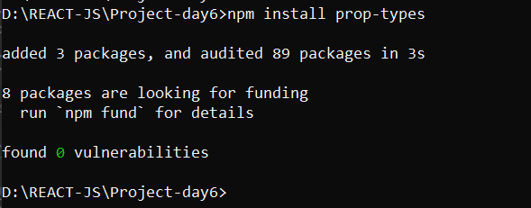
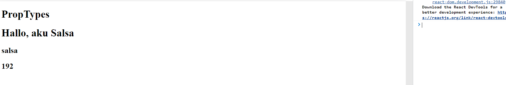
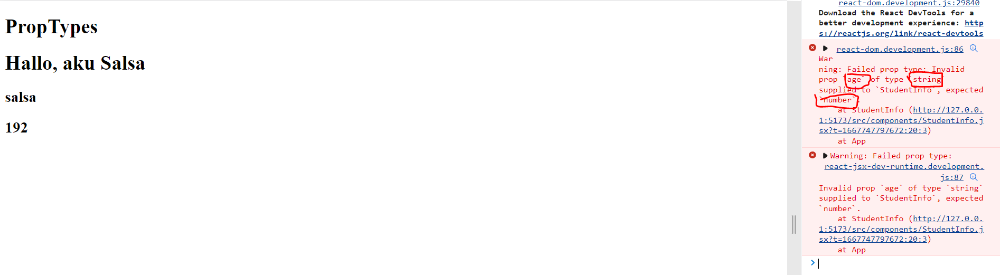
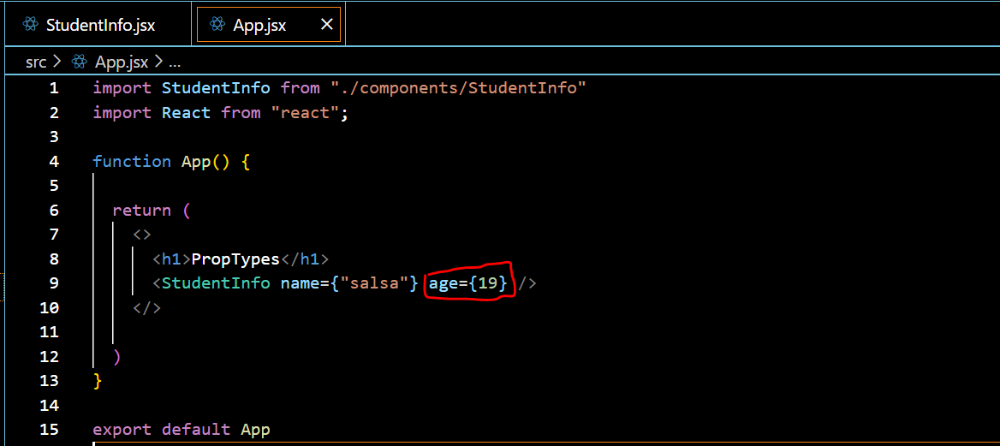
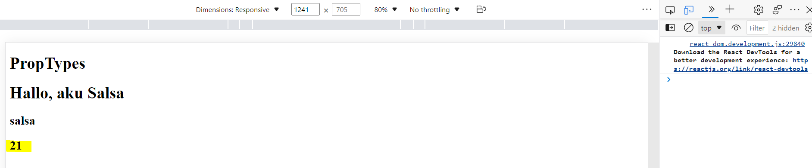

# WEEK 7

Nama : Salsabilla Pramudita\
Track : FrontEnd Development\
Week 2 Front End Bootcamp

Materi : 
- Day 1 React. JS Lanjutan - Proptypes


### Day 1 React. JS Lanjutan - Proptypes
 PropTypes merupakan library untuk menvalidasi props. Ini sangat membantu dalam meminimalkan bugs saat mengembangkan App besar. Jika props tidak benar type nya maka akan muncul warning.
 
 - Install PropTypes
    ```
    npm install prop-types
    ```
    
    
    
  - contoh bug
  
  disini saya membuat folder component dengan file bernama StudentInfo.jsx.
  
   ```js
      const StudentInfo= ({name, age})=> {
        return(
            <>
            <h1>Hallo, aku Salsa</h1>

            <h2>{name}</h2>
            <h2>{age+2}</h2>
            </>
        )
    }
    
   ```
    
        
 file app.jsx
    
   ```js
     import StudentInfo from "./components/StudentInfo"
     import React from "react";

     function App() {

       return (
         <>
           <h1>PropTypes</h1>
           <StudentInfo name={"salsa"} age={"19"} />
         </>

       )
     }

     export default App
  ```
    
  output 
  
    
dari codingan di file app.jsx saya memberikan age dengan tipe data string, yang mana itu tidak sesuai dengan expectasi yang telah saya buat di file StudentInfo. saya menginginkan age tersebut bertipe data number. dan hasil nya seperti output diatas yang mana tidak ada pesan eror yang memberitahu kita. maka disinilah fungsi PropTypes. PropTypes berfungsi sebagai TextChecking yang mengvalidasi tipe data kita benar atau salah.

- contoh proptypes di tipe data string dan number

  disini saya menambahkan proptypes pada file studentInfo dan file app nya masi sama seperti sebelumnya
  ```js
  import PropTypes from "prop-types"

  const StudentInfo= ({name, age})=> {
      return(
          <>
          <h1>Hallo, aku Salsa</h1>

          <h2>{name}</h2>
          <h2>{age+2}</h2>
          </>
      )
  }
  StudentInfo.propTypes = {
      name : PropTypes.string,
      age : PropTypes.number,

  }

  export default StudentInfo
  ```
  
  output
   
   
   dari output diatas sudah adanya pesan eror. yang mana si age harus bertipe data number. ini terjadi karna di file studentInfo saya memberikan proptypes kepada name dan string. maka supaya kasus ini tidak ada pesan error maka di file app, kita harus mengubah value dari si age menjadi number bukan string
   
   
   
   maka outputnya akan seperti ini
   
   
   
   nah disini age sudah sesuai dengan ekspektasi
   
- contoh proptypes di tipe data bebas
  ```js
  name: PropTypes.any.isRequired, 
  ```
  fungsi isRequired artinya data harus ada
  
- memberikan opsi untuk type data
  ```js
  age: PropTypes.oneOfType([PropTypes.string, PropTypes.number]),
  ```
   disini maksudnya tipe data dari si age bisa string dan bisa number
   
- type data array
  ```js
  data: PropTypes.array,
  ```
- mengecek value dari props
  ```
  data: PropTypes.arrayOf(PropTypes.number),
  ```
  
- array dengan berbagai type data
  ```
  data: PropTypes.arrayOf(PropTypes.oneOfType([PropTypes.number, PropTypes.string])),
  ```
  
- contoh proptypes di tipe data object 
  ```
  info: PropTypes.object,
  ```
  
  file app.jsx
  ```js
  import React from "react";
  import StudentInfo from "./components/StudentInfo";

  const App = () => {
    return (
      <>
        <h1>Prop Types</h1>
        <StudentInfo name={"Salsa"} age={19} data={[1, "2"]} info={{ hobby: "menyanyi", class: 9 }} />
      </>
    );
  };

  export default App;
  ```
  
- mengecek nilai dari object
  ```js
      info: PropTypes.shape({
        hobby: PropTypes.string,
        class: PropTypes.number,
      }),
  ```
  
 - mengecek nilai dan key dari object
   ```js
   info: PropTypes.exact({
      hobby: PropTypes.string,
      class: PropTypes.number,
    }).isRequired,
  };

   ```


   
   
  
  

