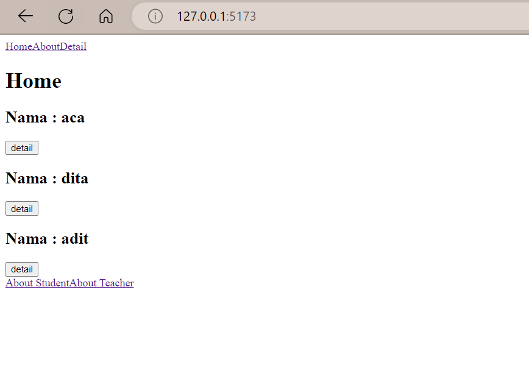

# WEEK 7

Nama : Salsabilla Pramudita\
Track : FrontEnd Development\
Week 2 Front End Bootcamp

Materi : 

**- Day 1 React. JS Lanjutan - Proptypes**

**- Day 2 React Router 6**

**- Day 3 State Management React Redux**


### Day 1 React. JS Lanjutan - Proptypes
 PropTypes merupakan library untuk menvalidasi props. Ini sangat membantu dalam meminimalkan bugs saat mengembangkan App besar. Jika props tidak benar type nya maka akan muncul warning.
 
 - Install PropTypes
    ```
    npm install prop-types
    ```
    
    
    
  - contoh bug
  
  disini saya membuat folder component dengan file bernama StudentInfo.jsx.
  
   ```js
      const StudentInfo= ({name, age})=> {
        return(
            <>
            <h1>Hallo, aku Salsa</h1>

            <h2>{name}</h2>
            <h2>{age+2}</h2>
            </>
        )
    }
    
   ```
    
        
 file app.jsx
    
   ```js
     import StudentInfo from "./components/StudentInfo"
     import React from "react";

     function App() {

       return (
         <>
           <h1>PropTypes</h1>
           <StudentInfo name={"salsa"} age={"19"} />
         </>

       )
     }

     export default App
  ```
    
  output 
  
    
dari codingan di file app.jsx saya memberikan age dengan tipe data string, yang mana itu tidak sesuai dengan expectasi yang telah saya buat di file StudentInfo. saya menginginkan age tersebut bertipe data number. dan hasil nya seperti output diatas yang mana tidak ada pesan eror yang memberitahu kita. maka disinilah fungsi PropTypes. PropTypes berfungsi sebagai TextChecking yang mengvalidasi tipe data kita benar atau salah.

- contoh proptypes di tipe data string dan number

  disini saya menambahkan proptypes pada file studentInfo dan file app nya masi sama seperti sebelumnya
  ```js
  import PropTypes from "prop-types"

  const StudentInfo= ({name, age})=> {
      return(
          <>
          <h1>Hallo, aku Salsa</h1>

          <h2>{name}</h2>
          <h2>{age+2}</h2>
          </>
      )
  }
  StudentInfo.propTypes = {
      name : PropTypes.string,
      age : PropTypes.number,

  }

  export default StudentInfo
  ```
  
  output
   
   
   dari output diatas sudah adanya pesan eror. yang mana si age harus bertipe data number. ini terjadi karna di file studentInfo saya memberikan proptypes kepada name dan string. maka supaya kasus ini tidak ada pesan error maka di file app, kita harus mengubah value dari si age menjadi number bukan string
   
   
   
   maka outputnya akan seperti ini
   
   
   
   nah disini age sudah sesuai dengan ekspektasi
   
- contoh proptypes di tipe data bebas
  ```js
  name: PropTypes.any.isRequired, 
  ```
  fungsi isRequired artinya data harus ada
  
- memberikan opsi untuk type data
  ```js
  age: PropTypes.oneOfType([PropTypes.string, PropTypes.number]),
  ```
   disini maksudnya tipe data dari si age bisa string dan bisa number
   
- type data array
  ```js
  data: PropTypes.array,
  ```
- mengecek value dari props
  ```
  data: PropTypes.arrayOf(PropTypes.number),
  ```
  
- array dengan berbagai type data
  ```
  data: PropTypes.arrayOf(PropTypes.oneOfType([PropTypes.number, PropTypes.string])),
  ```
  
- contoh proptypes di tipe data object 
  ```
  info: PropTypes.object,
  ```
  
  file app.jsx
  ```js
  import React from "react";
  import StudentInfo from "./components/StudentInfo";

  const App = () => {
    return (
      <>
        <h1>Prop Types</h1>
        <StudentInfo name={"Salsa"} age={19} data={[1, "2"]} info={{ hobby: "menyanyi", class: 9 }} />
      </>
    );
  };

  export default App;
  ```
  
- mengecek nilai dari object
  ```js
      info: PropTypes.shape({
        hobby: PropTypes.string,
        class: PropTypes.number,
      }),
  ```
  
 - mengecek nilai dan key dari object
   ```js
     info: PropTypes.exact({
        hobby: PropTypes.string,
        class: PropTypes.number,
      }).isRequired,
    };

    ```


### Day 2 React Router 6

Routing adalah proses di mana pengguna diarahkan ke halaman yang berbeda berdasarkan tindakan atau permintaan mereka. Router ReactJS terutama digunakan untuk mengembangkan Aplikasi Web Halaman Tunggal. React Router digunakan untuk menentukan beberapa rute dalam aplikasi. Saat pengguna mengetik URL tertentu ke browser, dan jika jalur URL ini cocok dengan ‘rute’ apa pun di dalam file router, pengguna akan diarahkan ke rute tersebut

- Install React Router
```
npm i react-router-dom
```
   
   
- BrowserRouter

  BrowserRoute adalah Langkah termudah untuk mengatur router. Yang perlu kita lakukan adalah mengimpor router spesifik yang dibutuhkan dan bungkus seluruh aplikasi di router itu.
  ```js
   import React from "react"
   import ReactDOM from "react-dom/client"
   import App from "./App"
   import { BrowserRouter } from "react-router-dom"

   const root = ReactDOM.createRoot(document.getElementById("root"))
   root.render(
     <React.StrictMode>
       <BrowserRouter>
         <App />
       </BrowserRouter>
     </React.StrictMode>
   )
  ```
 - Konfigurasi route
  
   untuk dapat mengkonfigurasi route kita tentunya perlu menyediakan sebuah component. contoh sederhananya saya akan membuat 3 file dikomponen bernama HomePage.jsx, AboutPage.jsx, dan DetailPage.jsx.
   
  codingan App.jsx
  ```js
  import {Routes, Route, Link} from "react-router-dom"
  import HomePage from "./pages/HomePage"
  import AboutPage from "./pages/AboutPage"
  import DetailPage from "./pages/DetailPage"

  const App = () => {

    return (
      <>
      <nav>
        <Link to={"/"}>Home</Link>
        <Link to={"/about"}>About</Link>
        <Link to={"/detail"}>Detail</Link>      
      </nav>


      <Routes>
        <Route path="/" element={<HomePage />} />
        <Route path="/detail/:id" element={<DetailPage />} />
        <Route path="/about" element={<AboutPage />} >

        </Route>  

      </Routes>
      </>

    )
  }

  export default App

  ```
  
  file HomePage.jsx
  
  ```js
   import {useNavigate, Link} from 'react-router-dom'

   const HomePage = () => {
       const navigation = useNavigate();
       let data = [
           {
               id : 1,
               nama : "aca",
           },
           {
               id : 2,
               nama : "dita",
           },
           {
               id : 3,
               nama : "adit",
           },


       ]

       const handleDetail = (id) => {
           navigation(`/detail/${id}`)

       }

       return (
           <>
           <h1>Home</h1>

           {
               data.map(el => {
                   return(
                       <div>
                       <h2>Nama : {el.nama}</h2>
                       <button onClick={() => handleDetail(el.id)}>detail</button>
                       </div>

                   )
               })
           }

           <Link to={"about/student"}>About Student</Link>
           <Link to={"about/teacher"}>About Teacher</Link>
           </>
       )
   }
   export default HomePage;
   ```
   dari kodingan homepage.jsx diatas saya sudah menambahkan useNavigate, button untuk detail nama user dan link menuju file aboutstudent dan about teacher. nah saya aka membahas satu satu.
   
   nah dari kodingan diatas saya memakai UseNavigate. Apa sih UseNavigate itu?
   
   **useNavigate** berfungsi untuk melakukan navigas, berpindah dari satu halaman ke halaman lain.
   
   selain itu saya juga menambahkan link untuk aboutstudent dan about teacher yang mana nantinya about tersebut akan kita jadikan child di route yang ada di app.jsx
   
   saya membuat file berikut untuk study kasus kali ini
     
     
     
   output
     
   
   dari gambar tersebut link ke about student dan about teacher sudah ada, akan tetapi jika diklik, page nya masi kosong. hal ini dikarenakan kita belum menambahkan route about student dan about teacher pada app.jsx
   


pada codingan diatas saya menambahkan AboutSchool. yang mana about school ini adalah default nya. jika mengklik link about maka langsung redirect ke aboutschool. dengan menambahkan outlet pada file aboutPage.jsx

  ```js
  import {Outlet, Link} from 'react-router-dom'

  const AboutPage = () => {
      return (
          <>
          {/* <h1>About</h1> */}
          <Outlet />

          <Link to={"student"}>About Student </Link>
          <Link to={"teacher"}>About Teacher </Link>

          </>
      )
  }
  export default AboutPage
  ```
  
peran ```<Outlet/>``` mirip dengan ```<children/>```, bedanya hasil render dari ```<Outlet/>``` ini akan dinamis berdasarkan path URL yang terdaftar. dari contoh diatas, terdapat Route parent dengan path='/about' yang memiliki children dengan path='student' dan path='teacher', ```<Outlet/>``` akan merender children tersebut sebagai ```<AboutPage />``` saat akses URL-nya /student (/ sebagai parent + student sebagai children), dan akan merender ```<DashboardTasks />``` saat akses URL-nya /teacher  (/ sebagai parent + teacher sebagai children). nah pada kali ini saya memberikan aboutschool sebagai index. maka yang akan dirender ketika mengklik about adalah aboutschool.

berikut kodingan detailPage.
  ```js
  import {useParams} from "react-router-dom"

  const DetailPage = () => {

      const {id} = useParams();
      console.log(id);

      const detailInfo= [
          {
              id : 1,
              nama : "aca",
              alamat : "pariaman",
              status : "mahasiswa",
          },
          {
              id : 2,
              nama : "dita",
              alamat : "padang",
              status : "pelajar",
          },
          {
              id : 3,
              nama : "adit",
              alamat : "sulawesi",
              status : "pegawai",
          },


      ]
      return (
          <>
          <h1>detail</h1>
          {
              detailInfo
              .filter((el) => el.id === +id)
              .map((el) =>{
                  return (
                      <div key={el.id}>
                          <h2>Nama : {el.nama}</h2>
                          <h2>Alamat : {el.alamat}</h2>
                          <h2>Status : {el.status}</h2>
                      </div>
                  )
              })
          }
          </>
      )
  }
  export default DetailPage;
  ```
  
  disini saya menggunakan useParams. useParamas digunakan untuk mengambil parameter rute dari komponen yang dirender oleh rute yang cocok.
  
  berikut output dari contoh kasus ini
  
  tampilan home
  
   

  tampilan detail
  
   

  tampilan about(default nya aboutschool)
  
   

  tampilan child about(student)
  
   
   
   
   ###  Day 3 State Management React Redux
   
   State management library adalah library yang digunakan untuk mengelola state pada suatu aplikasi JavaScript.
   
   - Mengapa harus menggunakan redux?
   - 
   Mengatur hubungan antara state dengan component pada React dapat dilakukan dengan hanya menggunakan state dan props. Tetapi pada aplikasi yang memilliki banyak sekali component mengelola state bisa menjadi sedikit rumit.

Sebuah state bisa digunakan oleh banyak sekali component, seringkali state harus dipindah ke parent component (lifting up) agar state tersebut dapat digunakan oleh component lain.

Ketika menggunakan React dengan Redux kita tidak perlu lagi memindahkan state dari satu component ke component lain, karena Redux mengubah state menjadi global state dan menempatkannya pada suatu tempat bernama store.

Setiap component dapat menggunakan state yang ada di store secara langsung.

Semua modifikasi state juga dilakukan melalui Redux, store pada Redux menjadi satu-satunya tempat untuk mengelola state(single source of truth).

Aplikasi menjadi lebih konsisten dan mudah untuk ditest.


 


   
   
  
  

